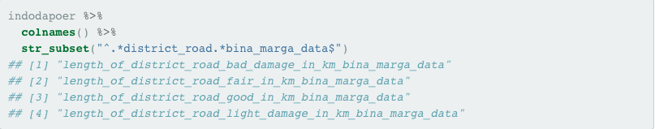

```{r setup, include=FALSE}
knitr::opts_chunk$set(echo = TRUE, comment = "", message = F, warning = F)
```

# Prolog

Bahasa R memiliki berbagai sistem untuk membuat grafik, baik grafik statis maupun grafik interaktif. Pada grafik statis misalnya terdapat sistem base, lattice, ggplot, dan lainnya. Di dalam modul ini Anda akan diajak untuk mengenal salah satu sistem grafik yang paling populer di R, yaitu ggplot.

Sistem pembuatan grafik dengan ggplot dapat dilakukan dengan menggunakan paket `ggplot2` yang merupakan implementasi dari konsep Grammar of Graphic untuk bahasa pemrograman R. Pada prinsipnya, konsep Grammar of Graphic mengajak kita untuk merekonstruksi pembuatan grafik dengan menggunakan kaidah tata bahasa sehingga tidak terikat pada nama jenis grafik (contoh: scatterplot, line-chart, bar-chart, dll.) seperti yang umumnya dilakukan. Taukah Anda bahwa Tableu merupakan salah satu aplikasi/program yang menerapkan konsep tersebut?

## Konsep Grammar of Graphic

Konsep Grammar of Graphic akan mengasah intuisi Anda untuk membentuk berbagai jenis grafik dengan lebih mudah, ringkas, dan tertata. Anda dapat membaca artikel mengenai implementasi konsep Grammar of Graphic di `ggplot2` melalui pranala [ini](http://vita.had.co.nz/papers/layered-grammar.pdf). Namun sekarang silakan aktifkan paket `ggplot2` dengan cara mengganti bagian ___ dengan jawaban yang tepat!

```{r}
library(ggplot2)
```

## Mengingat Kembali

Taukah Anda bahwa pada `ggplot2` terdapat satu fungsi yang dapat digunakan untuk membuat grafik dengan cepat? Fungsi tersebut adalah `qplot()`! Sesuai dengan namanya, quick plot, sangat bermanfaat untuk membuat grafik dengan ringkas dan cepat. Penggunaannya juga lebih mudah bagi yang sudah terbiasa dengan fungsi `plot()` dari sistem grafik base.

Anda diminta untuk membuat sebuah grafik dengan menggunakan data `diamonds` yang tersedia dalam paket ggplot2. Anda dapat melihat isi serta dokumentasi dari dataset tersebut dengan menjalankan `diamonds` dan `?diamonds` di konsol R (atau klik tautan [ini](https://ggplot2.tidyverse.org/reference/diamonds.html) jika untuk dokumentasi daring). Setelah Anda membaca dokumentasi data `diamonds` tersebut, isilah bagian ___ untuk membuat grafik hubungan antara berat (sumbu x), harga (sumbu y) dan kejernihan intan! Apakah nama dari grafik apakah yang Anda dapatkan?

```{r}
qplot(x = carat, y = price, colour = clarity, data = diamonds)
```

## Pembuatan Grafik dengan ggplot

Mudah sekali bukan untuk membuat grafik menggunakan `qplot()`? Namun sayangnya hal tersebut hanya berlaku untuk grafik-grafik sederhana. Jika Anda ingin membuat grafik yang lebih kompleks dan menawan, maka saatnya Anda beralih menggunakan fungsi `ggplot()` untuk membuat grafik tersebut.

Lantas bagaimanakah cara untuk menghasilkan grafik serupa namun dengan menggunakan fungsi `ggplot()`? Silakan Anda lengkapi dan jalankan baris kode berikut!

```{r}
ggplot(data = diamonds,
       mapping = aes(x = carat, y = price, colour = clarity)) +
  geom_point()
```

## Kode 3 Rupa

Salah satu kelebihan dari ggplot2 terletak pada fleksibiltas penulisan kodenya. Perhatikan baris kode yang telah Anda buat sebelumnya sebagai berikut:

```{r}
diamonds_c1 <- 
  ggplot(data = diamonds,
         mapping = aes(x = carat, y = price, colour = clarity)) +
  geom_point()

summary(diamonds_c1)
```

Anda dapat menuliskan ulang kode di atas dan menghasilkan grafik yang persis serupa dengan menggunakan cara penulisan berikut:

```{r}
diamonds_c2 <- 
  ggplot(data = diamonds) +
	geom_point(mapping = aes(x = carat, y = price, colour = clarity))

summary(diamonds_c2)
```

atau sebagai berikut :

```{r}
diamonds_c3 <-
  ggplot() +
	geom_point(data = diamonds,
	           mapping = aes(x = carat, y = price, colour = clarity))

summary(diamonds_c3)
```

Grafik yang akan dihasilkan oleh tiga cara penulisan tersebut adalah identik. Namun, jika diperhatikan lebih mendalam dengan menggunakan fungsi `summary()` akan tampak perbedaan diantara ketiganya.

Simpanlah grafik dari masing-masing cara penulisan tersebut ke dalam obyek bernama `diamonds_c1`, `diamonds_c2`, dan `diamonds_c3`. Kemudian jalankan fungsi `summary()` terhadap tiga obyek tersebut! Apakah yang Anda temukan?

## Komponen Dasar Pembuatan Grafik

Selamat Anda telah berhasil membuat grafik dengan menggunakan fungsi `qplot()` dan `ggplot()`! Setelah menuliskan dan menjalankan beberapa kode pada sub-bab sebelumnya, Anda mungkin menyadari bahwa setidaknya terdapat tiga komponen dasar dalam pembuatan grafik yaitu:

1. *Data*, yaitu data berisi informasi yang akan dibuat grafik
2. *Mapping*, yaitu penentuan variabel/kolom yang akan ditampilkan dalam grafik
3. *Geometries*, yaitu representasi visual dari variabel/kolom dalam grafik

Kode pembuatan grafik menggunakan `ggplot2(`) dapat disederhanakan dalam bentuk yang lebih umum. Misalnya penulisan kode untuk membuat grafik menggunakan fungsi `qplot()` dapat digeneralisasi sebagai berikut:

```
qplot(<MAPPING>, data = <DATA>, geom = <GEOM>)
```

Sedangkan untuk fungsi `ggplot()`, penulisan kode dapat digeneralisasi dalam tiga bentuk sebagai berikut:

**Cara 1**

```
ggplot(data = <DATA>, mapping = aes(<MAPPINGS>)) +
  <GEOM_FUNCTION>()  
```

**Cara 2**

```
ggplot(data = <DATA>) +
  <GEOM_FUNCTION>(mapping = aes(<MAPPINGS>))  
```

**Cara 3**

```
ggplot() +
  <GEOM_FUNCTION>(data = <DATA>, mapping = aes(<MAPPINGS>)
```

## Kuis
Berdasarkan beberapa varian kode yang telah Anda jalankan serta informasi dari dokumentasi fungsi `ggplot()`, jawablah pertanyaan-pertanyaan berikut:

1. Menurut Anda manakah yang lebih mudah dan manakah yang lebih fleksibel digunakan antara `qplot()` dan `ggplot()`?

**qplot(), lebih mudah. ggplot(), lebih fleksibel**

2. Cara penulisan mana yang telah Anda ketahui sebelum mengerjakan modul ini? Jika jawaban Anda adalah `ggplot()`, maka cara penulisan mana yang sering Anda pergunakan?

**ggplot(), Cara 1**

3. Jika Anda memiliki lebih dari satu dataframe dan akan membuat grafik yang kompleks, cara penulisan `ggplot()` mana yang akan Anda gunakan?

**Cara 3**

4. Cara penulisan `ggplot()` mana yang sebaiknya digunakan jika digunakan aesthetic mapping beragam antar satu layer dengan layer lainnya?

**Cara 2**

## Delapan Komponen Dalam Grafik

Selain tiga komponen dasar yang sebelumnya telah disinggung, dalam konsep Grammar of Graphic terdapat lima komponen utama lainnya yang berperan penting dalam pembuatan sebuah grafik. Berikut merupakan delapan komponen dalam grafik:

1. *Data*
2. *Mapping*
3. *Statistic*
4. *Scales*
5. *Geometries*
6. *Facets*
7. *Coordinates*
8. *Theme*

Cukup banyak bukan? Dalam modul ini Anda akan diajak untuk mengenal komponen-komponen dengan lebih dekat. Apakah Anda bersemangat?

## Yin dan Yang

Namun tunggu dulu! Sebelum menyelam dalam visualisasi, ada baiknya kita membahas suatu aktivitas yang sulit dilepaskan dari proses pembuatan grafik. Aktivitas tersebut adalah transformasi data! Seringkali kita harus menyesuaikan bentuk dari data yang kita miliki agar dapat lebih mudah mewujudkannya dalam sebuah grafik. Ya, transformasi dan visualisasi merupakan komplementer satu sama lain. Jika Anda ingin menguasai visualisasi data, maka alangkah baiknya Anda juga memahami proses transformasi data.

Di R, salah satu kumpulan paket yang populer digunakan untuk melakukan transformasi dan visualisasi data adalah `tidyverse`. Jika `ggplot2` berperan utama dalam hal visualisasi data, maka paket yang berperan utama dalam hal transformasi data adalah `dplyr` dan `tidyr`. `ggplot2` bersama dengan `dplyr` serta `tidyr`, `readr`, `tibble`, `stringr`, `forcats`, dan `purrr` merupakan paket utama dalam `tidyverse`.

Sekarang aktifkanlah paket `dplyr` dengan cara mengganti bagian ___ dengan jawaban yang tepat!

```{r}
library(dplyr)
```

## Paket dplyr

Terdapat beberapa fungsi utama dari paket `dplyr` untuk melakukan transformasi data, diantaranya:

- `select()`
- `filter()`
- `arrange()`
- `mutate()`
- `summarise()`
- `group_by()`

Bacalah dokumentasi masing-masing fungsi di atas dengan cara menjalankan `help(nama_fungsi)` atau `?nama_fungsi` pada konsol R. Atau Anda dapat mengunjungi laman dokumentasi daring `dplyr` melalui tautan [ini.](https://dplyr.tidyverse.org/reference/index.html)

Benar atau salah jika fungsi `select()` dan `filter()` dari paket `dplyr` ekivalen dengan fungsi `subset()` dari paket `base`? Tulis `TRUE` jika benar, dan `FALSE` jika salah.

```{r}
TRUE
```

## Transformasi Data

Transformasi data umumnya merupakan sebuah rangkaian yang terdiri lebih dari satu proses. Oleh karena itu, dalam tranformasi data menggunakan dplyr sering digunakan *operator pipe* (`%>%`) untuk menghubungkan antara satu fungsi ke fungsi selanjutnya. Sebagai ilustrasi, Anda akan diminta untuk melakukan transformasi data `storms` (dari paket `dplyr`) dengan dan tanpa menggunakan operator pipe:

**Tanpa menggunakan** `%>%`

```{r}
storms1 <- select(storms, year, month, wind, pressure)
storms2 <- filter(storms1, between(year, 2000, 2015))
storms3 <- mutate(storms2, month = factor(month.name[storms2$month], levels = month.name))
storms4 <- group_by(storms3, month)
storms_nopipe <- summarise(storms4, avg_wind = mean(wind), avg_pressure = mean(pressure))

glimpse(storms_nopipe)
```

**Mengggunakan** `%>%`

```{r}
storms_pipe <-
  storms %>%
  select(year, month, wind, pressure) %>%
  filter(between(year, 2000, 2015)) %>%
  mutate(month = factor(month.name[month], levels = month.name)) %>%
  group_by(month) %>%
  summarise(avg_wind = mean(wind),
            avg_pressure = mean(pressure))

glimpse(storms_pipe) 
```
```{r}
identical(storms_nopipe, storms_pipe)
```

## Operator Pipe

Berikut merupakan baris kode transformasi menggunakan operator pipe yang sebelumnya telah Anda jalankan:

```
storms %>%
  select(year, month, wind, pressure) %>%
  filter(between(year, 2000, 2015)) %>%
  mutate(month = factor(month.name[month], levels = month.name)) %>%
  group_by(month) %>%
  summarise(
    avg_wind = mean(wind),
    avg_pressure = mean(pressure)
  )
```

# INDO-DAPOER

Mari kita mulai! Sekarang Anda akan ditantang untuk melakukan eksplorasi dan visualisasi data INDO-DAPOER, yaitu akronim dari Indonesia Database for Policy and Economic Research. Data tersebut disediakan oleh The World Bank dan tersedia dalam pranala [ini](https://datacatalog.worldbank.org/dataset/indonesia-database-policy-and-economic-research).

Singkatnya, INDO-DAPOER merupakan data yang berisikan indikator ekonomi dan sosial pada level provinsi serta kota/kabupaten di Indonesia. Ada empat kategori utama yang terhimpun di dalam data ini, yaitu: fiskal, ekonomi, sosial-demografi, serta infrastuktur.

Menarik sekali bukan?

## Import Dataset

Di dalam modul ini dataset INDO-DAPOER disediakan dalam bentuk yang telah disederhanakan dan dikompresi dikarenakan ukurannya yang relatif besar. Anda akan memerlukan paket `readr` untuk mengimpor berkas `indodapoer.tsv.gz` yang telah disediakan, yaitu "https://dqlab-dataset.s3-ap-southeast-1.amazonaws.com/indodapoer.tsv.gz". Pergunakan fungsi `read_tsv()` dan simpanlah hasilnya ke dalam obyek R bernama `indodapoer`! Berapakah jumlah baris dan kolom dari data tersebut?

```{r}
library(readr)

indodapoer <- read_tsv("https://dqlab-dataset.s3-ap-southeast-1.amazonaws.com/indodapoer.tsv.gz")

nrow(indodapoer)
ncol(indodapoer)
```

## Wild Names and How to Tame Them

Ya! Data `indodapoer` memiliki 22468 baris dan 222 kolom. Data yang cukup kompleks bukan?

Jika Anda perhatikan nama-nama kolom pada tersebut masih banyak yang tidak memenuhi kaidah “syntactically valid names” di R (tips: silakan baca dokumentasi fungsi `make.names()`). Silakan Anda periksa nama 15 kolom pertama menggunakan colnames(), kemudian jalankan `clean_names()` dari paket `janitor` untuk menangani permasalahan nama kolom tersebut dan simpan hasilnya sebagai `indodapoer`, selanjutnya periksa kembali nama 15 kolom pertama dari data yang telah diproses tersebut!

```{r}
library(janitor)

head(colnames(indodapoer), 15)
indodapoer <- clean_names(indodapoer)
head(colnames(indodapoer), 15)
```

## Mudah, bukan?

Dengan satu fungsi `clean_names()` Anda dapat merapikan nama-nama kolom sehingga akan lebih mudah digunakan untuk analisis atau visualisasi data.

# Indonesia Negeriku

## Produk Domestik Regional Bruto

Anda tertarik untuk melihat perkembangan Produk Domestik Regional Bruto (PDRB) Non-Migas dari provinsi-provinsi di pulau Jawa. Informasi PDRB Non-Migas tersebut tersimpan pada kolom total_gdp_excluding_oil_and_gas_in_idr_million_constant_price. Sebelum memulai membuat visualisasi, ekstraklah data tersebut menjadi pdrb_pjawa dengan cara melengkapi baris kode yang tersedia!

```{r}
library(stringr)

pdrb_pjawa <- 
  indodapoer %>%
  filter(
    area_name %in% c(
      "Banten, Prop.",
      "DKI Jakarta, Prop.",
      "Jawa Barat, Prop.",
      "Jawa Tengah, Prop.",
      "DI Yogyakarta, Prop.",
      "Jawa timur, Prop."
    )
  ) %>%
  transmute(
    provinsi = str_remove(area_name, ", Prop."),
    tahun = year,
    pdrb_nonmigas = total_gdp_excluding_oil_and_gas_in_idr_million_constant_price) %>% 
    filter(!is.na(pdrb_nonmigas))

glimpse(pdrb_pjawa)
```

## Grafik PDRB Non-Migas

Dengan menggunakan data `pdrb_pjawa` kita akan membuat grafik tren PDRB Non-Migas dengan baris kode berikut:

```
ggplot(pdrb_pjawa,
       aes(tahun, pdrb_nonmigas, colour = provinsi)) +
  geom_line()
```

Apakah Anda menemukan kejanggalan pada grafik tersebut? Ya! Urutan nama provinsi pada legenda tidak mempresentasikan urutan yang ditampilkan pada grafik. Bayangkan jika Anda memiliki lebih banyak nama provinsi yang ditampilkan pada grafik, akan sulit untuk dapat mencocokan nama pada legenda dan garis pada grafik.

Solusi pertama yang dapat Anda lakukan adalah dengan cara mengurutkan nama provinsi berdasarkan besaran PDRB Non-Migas pada tahun terakhir. Bagaimanakah caranya? Silakan Anda lengkapi baris kode berikut! Anda juga perlu mengaktifkan paket `forcats` terlebih dahulu ya!

```{r}
library(forcats)

pdrb_pjawa %>%
  mutate(provinsi = fct_reorder2(provinsi, tahun, pdrb_nonmigas)) %>%
  ggplot(aes(tahun, pdrb_nonmigas, colour = provinsi)) +
    geom_line()
```

## Direct Labeling

Solusi kedua untuk mengatasi permasalahan pada grafik sebelumnya dalah dengan menggunakan direct labeling. Hal ini lebih direkomendasikan karena salah satu prinsip dalam merancang grafik adalah “sebisa mungkin rancang grafik yang tidak memerlukan legenda”. Anda dapat memanfaatkan fungsi `geom_dl()` dari paket `directlabels` untuk membuat direct labeling di `ggplot2`. Adapun aesthetic mapping yang diperlukan dalam `geom_dl()` tersebut adalah label. Sekarang buatlah grafik serupa namun menggunakan direct labeling! Serta jangan lupa untuk menghapus legenda nama provinsi dengan cara menambahkan argumen `show.legend = FALSE` pada `geom_line()`.

```{r}
library(directlabels)

pdrb_pjawa %>% 
  ggplot(aes(tahun, pdrb_nonmigas)) +
  geom_line(aes(colour = provinsi), show.legend = FALSE) +
  geom_dl(
    aes(label = provinsi), 
    method = "last.points",
    position = position_nudge(x = 0.3) # agar teks tidak berhimpitan dengan garis
  )
```

## Finalisasi Grafik

Selamat Anda telah berhasil membuat grafik menggunakan direct labeling! Selain itu, apakah Anda menyadari bahwa pada beberapa kode sebelumnya suatu data (tanpa atau dengan transformasi) langsung diarahkan ke `ggplot()` dengan menggunakan *operator pipe* `(%>%`)? Fitur tersebut tentu sangat mempermudah dalam aktivitas transformasi dan visualisasi data, apakah Anda setuju?

Sekarang saatnya Anda melakukan finalisasi untuk grafik yang telah dibuat. Ada beberapa hal yang harus Anda lakukan, termasuk memperbaiki teks nama provinsi yang terpotong pada kanvas. Jalankanlah langkah-langkah di bawah ini!

- Bagi `pdrb_nonmigas` dengan `1e6` (satu juta), sehingga staun `pdrb_nonmigas` sekarang adalah dalam triliun
- Tambahkan label pada grafik menggunakan fungsi `labs()`. Beri label sebagai berikut:
  - Judul: “PDRB Non-Migas di Pulau Jawa Hingga Tahun 2011”
  - Subjudul: “PDRB atas dasar harga konstan, dalam satuan triliun”
  - Sumbu x: (tidak ada label)
  - Sumbu y: (tidak ada label)
  - Caption: “Data: INDO-DAPOER, The World Bank”
- Non-aktifkan clipping pada kanvas dengan mengatur argumen `clip = "off"` pada `coord_cartesian()` [Catatan: cara ini terkadang perlu dikombinasikan dengan argumen `expand` pada `scale_x/y_***()`]
- Pergunakan `theme_ipsum()` dari paket `hrbrthemes` untuk memodifikasi tema

```{r}
library(hrbrthemes)

pdrb_pjawa %>% 
  ggplot(aes(tahun, pdrb_nonmigas / 1e6)) +
  geom_line(aes(colour = provinsi), show.legend = FALSE) +
  geom_dl(
    aes(label = provinsi), 
    method = "last.points",
    position = position_nudge(x = 0.3) # agar teks tidak berhimpitan dengan garis
  ) +
  labs(
    x = NULL,
    y = NULL,
    title = "PDRB Non-Migas di Pulau Jawa Hingga Tahun 2011",
    subtitle = "PDRB atas dasar harga konstan, dalam satuan triliun",
    caption =  "Data: INDO-DAPOER, The World Bank"
  ) +
  coord_cartesian(clip = "off") +
  theme_ipsum(grid = "Y", ticks = TRUE)
```

## Seluas Apa?

Indonesia merupakan negara kepulauan yang sangat luas, tentu Anda telah mengetahui akan hal tersebut. Namun bagaimanakah perbandingan luas provinsi-provinsi di Indonesia?

Dalam data indodapoer, data luas wilayah tersedia dalam kolom `total_area_in_km`. Data termutakhir adalah pada tahun 2009. Dapatkah Anda mengekstrak data tersebut menjadi obyek R bernama `luas_provinsi`?

```{r}
luas_provinsi <- 
  indodapoer %>% 
  filter(str_detect(area_name, "Prop")) %>% 
  filter(year == 2009) %>%
  transmute(
    provinsi = str_remove(area_name, ", Prop."),
    luas_wilayah = `total_area_in_km²`
  )
glimpse(luas_provinsi)
```

## Komparasi Luas Wilayah

Selanjutnya Anda ditantang untuk membuat komparasi luas wilayah antar provinsi tersebut dalam sebuah grafik bernama treemap. Apakah sebelumnya Anda pernah membuat grafik ini?

Anda dapat menggunakan fungsi `geom_treemap()` dari `treemapify` untuk membuat grafik tersebut. Aesthetic mapping wajib dalam `geom_treemap()` tersebut adalah `area`. Selain itu, untuk menambahkan teks label Anda perlu menggunakan geometry object khusus, yaitu `geom_treemap_text()`. Apakah Anda ingat apa aesthetic mapping wajib jika ingin menuliskan teks? Dengan menggunakan data `luas_provinsi` dapatkah Anda membuat grafik tersebut?

```{r}
library(treemapify)

luas_provinsi  %>% 
  ggplot(aes(area = luas_wilayah)) +
  geom_treemap() +
  geom_treemap_text(aes(label = provinsi))
```

## Modifikasi Grafik

Luar biasa! Anda telah berhasil membuat grafik dasar dari treemap luas provinsi! Sekarang mari lakukan beberapa modifikasi untuk mempercantik tampilan grafik tersebut:

- Menambahkan `luas_wilayah` sebagai aesthetic mapping warna kotak
- Menggunakan palet warna viridis untuk menyatakan `luas_wilayah`
- Mengatur posisi, ukuran, dan label pada legenda petunjuk gradasi warna. Anda akan memerlukan fungsi `label_number()` dari paket `scales`
- Mengganti fonta nama provinsi menjadi “Arial Narrow”, warna menjadi putih, dan konfigurasi ukuran fonta dinamis
- Menambahkan judul, subjudul, dan caption
- Mengganti tema plot meenggunakan `theme_ipsum()` dari paket `hrbrthemes`

```{r}
library(scales)

luas_provinsi %>% 
  ggplot(aes(
    area = luas_wilayah, 
    fill = luas_wilayah)
  ) +
  geom_treemap() +
  geom_treemap_text(
    aes(label = provinsi), 
    family = "Arial Narrow",
    colour = "white",
    reflow = TRUE,
    grow = TRUE
  ) +
  scale_fill_viridis_c(
    guide = guide_colourbar(
      barwidth = 30,
      barheight = 0.8
    ),
    labels = label_number(
      big.mark = ".", 
      decimal.mark = ",", 
      suffix = " km2")
  ) +
  labs(
    fill = "Luas\nwilayah",
    title = "Perbandingan Luas 33 Provinsi di Indonesia",
    subtitle = "Berdasarkan data tahun 2009, sehingga Kalimantan Utara tidak tercantum dalam grafik",
    caption = "Data: INDO-DAPOER, The World Bank"
  ) +
  theme_ipsum() +
  theme(legend.position = "bottom")
```

## Perjalanan Ini

Menarik bukan? Pembuatan kode di `ggplot()` sangat fleksibel dan ada banyak konfigurasi grafik yang dapat dilakukan didalamnya. Nah, seperti telah disinggung sebelumnya bahwasanya dalam membuat visualisasi seringkali ada aktivitas lain yang juga tak kalah penting. Apakah Anda masih ingat apa itu? Transformasi data!

Pada sub-bab ini, Anda akan banyak melakukan proses transformasi data sebelum akhirnya membuat visualisasi yang menarik. Anda diminta untuk mengamati kondisi infrastruktur jalan raya di seluruh kabupatan dan kota di Indonesia. Menarik bukan? Berikut merupakan baris kode untuk melihat nama-nama kolom yang berkaitan dengan informasi yang Anda cari:



Dengan menggunakan nama-nama kolom tersebut, lengkapilah baris kode berikut untuk membuat data jalan_kabkota pada tahun 2008!

```{r}
jalan_kabkota <- 
  indodapoer %>% 
  filter(str_detect(area_name, ", Prop.", negate = TRUE)) %>% 
  filter(year == 2008) %>%
  transmute(
    kabkota = area_name,
    jalan_rusak_parah = length_of_district_road_bad_damage_in_km_bina_marga_data,
    jalan_rusak_ringan = length_of_district_road_light_damage_in_km_bina_marga_data,
    jalan_cukup_baik = length_of_district_road_fair_in_km_bina_marga_data,
    jalan_sangat_baik = length_of_district_road_good_in_km_bina_marga_data
  )

glimpse(jalan_kabkota)
```

## Pivot

Selanjutnya Anda diminta untuk melakukan pivot pada data `jalan_kabkota` tersebut sehingga menghasilkan sebuah dataframe dengan tiga kolom, yaitu: `kabkota`, `kondisi`, dan `panjang_jalan`. Anda dapat melakukan hal tersebut dengan menggunakan fungsi `pivot_longer()` dari paket `tidyr`. Lengkapi baris kode berikut dan simpanlah hasilnya sebagai `jalan_kabkota` (nama yang sama seperti sebelumnya). Berapa banyak baris serta kolom dari data tersebut sebelum dan setelah dilakukan pivot?

```{r}
library(tidyr)

glimpse(jalan_kabkota)
jalan_kabkota  <- 
  jalan_kabkota %>% 
  pivot_longer(
    cols = starts_with("jalan_"),
    names_to = "kondisi",
    names_prefix = "jalan_",
    values_to = "panjang_jalan"
  )

glimpse(jalan_kabkota)
```

## The Next Step

Luar biasa! Namun, masih ada dua tahap yang masih perlu Anda lakukan:

- Menentukan mana wilayah kabupaten dan mana wilayah kota
- Mengatur level dari kolom kondisi berdasarkan tingkat keparahan sekaligus memperbaiki penulisan teks agar dapat ditampilkan lebih rapi di dalam grafik

```{r}
jalan_kabkota <-
  jalan_kabkota %>%
  mutate(
    status = case_when(
      str_detect(kabkota, ", Kab") ~ "Kabupaten",
      str_detect(kabkota, ", Kota") ~ "Kota",
      str_detect(kabkota, "City") ~ "Kota",
      TRUE ~ NA_character_
    ),
    kondisi = factor(
      kondisi,
      levels = c("rusak_parah", "rusak_ringan", "cukup_baik", "sangat_baik"),
      labels = c("Rusak parah", "Rusak ringan", "Cukup baik", "Sangat baik")
    )
  )

glimpse(jalan_kabkota)
```

## Grafik Kondisi Jalan

Akhirnya Anda berhasil melakukan transformasi data! Proses yang cukup melelahkan bukan?

Sekarang saatnya Anda membuat grafik yang akan menunjukan kondisi jalan raya di kabupaten & kota berdasarkan kondisinya. Sebelum Anda melanjutkan ke sub-bagian selanjutnya, apakah Anda sudah memiliki ide tentang grafik apa yang dibuat untuk topik tersebut?

**Ridgeline plot**! Itulah nama grafik yang akan Anda buat dengan menggunakan data `jalan_kabkota` tersebut. Apakah Anda pernah membuat grafik jenis ini?

Rideline plot sangat bermanfaat untuk menampilkan perubahan distribusi dari suatu variabel numerik. Agar lebih mempermudah pemahaman, silakan Anda lengkapi dan jalankan baris kode berikut ya! Psst, Anda akan memerlukan paket `ggridges` untuk membuat grafik ini.

```{r}
library(ggridges)

jalan_kabkota_plot <- 
  jalan_kabkota  %>% 
  ggplot(aes(panjang_jalan, kondisi)) +
  facet_wrap(~status) +
  geom_density_ridges_gradient(
    aes(fill = after_stat(x)), 
    show.legend = FALSE
  )

jalan_kabkota_plot
```

## Transformasi Logaritmik

That’s the idea! Di ridgeline plot Anda dapat melakukan komparasi distribusi jalan kabupaten/kota berdasarkan berdasarkan kondisinya dengan mudah. Namun, dalam grafik tersebut masih ada beberapa hal yang harus diperbaiki. Contohnya adalah transformasi pada sumbu-x untuk menangani permasalahan nilai kecil vs nilai besar serta penambahan teks judul, subjudul, dan caption.

Lakukan transformasi logaritmik basis 10 pada sumbu-x menggunakan fungsi `scale_x_continous()`. Aturlah argumen `trans = "log10"` pada fungsi tersebut. Selain itu, Anda diminta untuk menambahkan garis vertikal untuk menandai panjang jalan 100 km. Pergunakanlah fungsi `geom_vline()` untuk melakukan hal tersebut!

```{r}
jalan_kabkota_plot <-
  jalan_kabkota %>%
  ggplot(aes(panjang_jalan, kondisi)) +
  facet_wrap(~status) +
  geom_density_ridges_gradient(
    aes(fill = after_stat(x)),
    show.legend = FALSE
  )

jalan_kabkota_plot +
  geom_vline(xintercept = 100, linetype = "dashed", colour = "darkslategray4") +
  scale_x_continuous(trans = "log10")
```

## Finalisasi

Jauh lebih baik, bukan? Anda juga dapat menggunakan `scale_x_log10()` yang merupakan wrapper dari fungsi `scale_x_continuous(trans = "log10")`. Ada berbagai transformasi yang dapat Anda lakukan pada axis grafik di `ggplot2()` dan banyak diantaranya telah tersedia pada paket `scales`.

Sekarang merupakan tahap finalisasi yang perlu Anda lakukan pada grafik ridgeline tersebut:

- Menambahkan `scale_fill_viridis_c(option = "magma")` untuk modifikasi warna
- Menambahkan keterangan judul, subjudul, dan caption
  - Judul: “Jalan Kabupaten/Kota Berdasarkan Kondisi”
  - Subjudul: “Berdasarkan data tahun 2008, garis vertikal menunjukan panjang jalan 100 Km”
  - Caption: “Data: INDO-DAPOER, The World Bank”
- Mengatur argumen `grid = FALS`E dan `ticks = TRUE` pada `theme_ipsum()`

```{r}
jalan_kabkota_plot <-
  jalan_kabkota %>%
  ggplot(aes(panjang_jalan, kondisi)) +
  facet_wrap(~status) +
  geom_density_ridges_gradient(
    aes(fill = after_stat(x)),
    show.legend = FALSE
  )

jalan_kabkota_plot +
  geom_vline(xintercept = 100, linetype = "dashed", colour = "darkslategray4") +
  scale_x_continuous(trans = "log10") +
  scale_fill_viridis_c(option = "magma") +
  labs(
    x = "Panjang jalan (Km)",
    y = NULL,
    title = "Jalan Kabupaten/Kota Berdasarkan Kondisi",
    subtitle = "Berdasarkan data tahun 2008, garis vertikal menunjukan panjang jalan 100 Km",
    caption = "Data: INDO-DAPOER, The World Bank"
  ) +
  theme_ipsum(grid = FALSE, ticks = TRUE)
```

## Fasilitas Kesehatan di Kalimantan

Bagaimanakah komposisi faskes di pulau Kalimantan? Nah, sekarang Anda kembali ditantang untuk membuat sebuah grafik unik bernama waffle charts untuk menjawab tersebut. Apakah Anda pernah mengetahui jenis grafik ini?

Berikut merupakan baris kode yang telah disediakan untuk mempersiapkan grafik. Salin dan jalankanlah di konsol serta simpanlah hasilnya sebagai obyek R bernama `faskes_kalimantan`!

```{r}
faskes_kalimantan <-
  indodapoer %>%
  filter(str_detect(area_name, "Kalimantan")) %>%
  filter(year == 2011) %>%
  transmute(
    provinsi = str_remove(area_name, ", Prop."),
    rumahsakit = number_of_hospitals,
    polindes = number_of_polindes_poliklinik_desa_village_polyclinic,
    puskesmas = number_of_puskesmas_and_its_line_services
  ) %>%
  pivot_longer(
    cols = -provinsi,
    names_to = "faskes",
    values_to = "jumlah"
  ) %>%
  filter(!is.na(jumlah)) %>%
  mutate(
    provinsi = fct_reorder(provinsi, jumlah, sum),
    jumlah = ceiling(jumlah / 10)
  )

glimpse(faskes_kalimantan)
```

## Waffle Charts

Waffle charts dapat dibuat di `ggplot2` dengan menggunakan bantuan paket `waffle`. `geom_waffle()` yang memiliki dua aesthetic mappings wajib, yakni `fill` dan `values`, merupakan fungsi utama dalam pembuatan jenis grafik tersebut. Sekarang buatlah basis grafik tersebut dengan menggunakan data `faskes_kalimantan` yang telah Anda siapkan!

Penuhilah ketentuan berikut: * `faskes` sebagai aesthetic mapping warna `fill` * `provinsi` sebagai argumen dalam `facet_wrap()` * Simpan hasilnya sebagai `faskes_kalimantan_plot`.

```{r}
# install.packages("waffle", repos = "https://cinc.rud.is")
library(waffle)

faskes_kalimantan_plot <- 
  ggplot(faskes_kalimantan, aes(fill = faskes, values = jumlah)) +
  facet_wrap(~provinsi) +
  geom_waffle(colour = "white")

faskes_kalimantan_plot
```

## Mengatur Warna dan Label

Selamat Anda telah berhasil membuat basis grafik yang diminta! Anda dapat melakukan kostumisasi warna sesuai dengan keinginan Anda dengan menggunakan fungsi `scale_fill_manual()` atau `scale_colour_manual()` jika aesthetic mapping warna yang digunakan adalah `colour`. Selain itu, Anda juga dapat melakukan modifikasi teks label langsung pada fungsi tersebut dengan mengatur argumen `labels` (apakah Anda masih ingat pada sub-bab sebelumnya hal tersebut dilakukan pada fungsi `factor()` dan `mutate()`?).

Sekarang aturlah warna dan label dengan ketentuan sebagai berikut:

- polindes = “seagreen3”. Ubah label teks menjadi “Poliklinik Desa”
- puskesmas = “steelblue”. Ubah label teks menjadi “Puskesmas”
- rumahsakit = “cyan4”. Ubah label teks menjadi “Rumah Sakit”

Selain hal di atas, pada kode yang tersedia Anda juga akan mengatur judul, subjudul, dan caption grafik. Simpanlah grafik hasil modifikasi tersebut ke dalam obyek R bernama `faskes_kalimantan_plot` (sama seperti obyek awal)!

```{r}
faskes_kalimantan_plot <-
  ggplot(faskes_kalimantan, aes(fill = faskes, values = jumlah)) +
  facet_wrap(~provinsi) +
  geom_waffle(colour = "white")
  
faskes_kalimantan_plot <- 
  faskes_kalimantan_plot +
  scale_fill_manual(
    values = c(
      "polindes" = "seagreen3",
	  "puskesmas" = "steelblue",
	  "rumahsakit" = "cyan4"
    ),
    labels = c(
      "polindes" = "Poliklinik Desa",
	  "puskesmas" = "Puskesmas",
	  "rumahsakit" = "Rumah Sakit"
    )
  ) +
  labs(
    fill = NULL,
    title = "Fasilitas Kesehatan di Kalimantan",
    subtitle = "Berdasarkan data tahun 2011, satu petak menyatakan ±10 faskes",
    caption = "Data: INDO-DAPOER, The World Bank"
  )

faskes_kalimantan_plot
```

## Finalisasi Waffle Charts

Luar biasa! Anda telah berhasil melakukan modifikasi warna sesuai dengan keinginan. Melalui teknik tersebut, Anda dapat menuangkan warna branding pada grafik sehingga menjadi produk yang memiliki jati diri Anda.

Hampir selesai! Ada dua tahap terakhir yang dapat Anda lakukan untuk menyelesaikan waffle chart `faskes_kalimantan_plot`. Pertama, memastikan agar aspect ratio antara sumbu-x dan sumbu-y adalah 1:1. Kedua, membuat kustomisasi tema grafik. Permasalahan pertama dapat Anda selesaikan dengan cara menambahkan fungsi     `coord_equal()`. Sedangkan permasalahan kedua dapat diselesaikan dengan fungsi `theme()`. Jika pada grafik-grafik sebelumnya Anda menggunakan `theme_ipsum()` yang berasal dari `hrbrthemes()`, maka kali ini Anda akan membuat sendiri tema sendiri. Keren, kan? Cobalah Anda atur font dengan menggunakan `family = "Arial Narrow"`!

```{r}
faskes_kalimantan_plot <-
  ggplot(faskes_kalimantan, aes(fill = faskes, values = jumlah)) +
  facet_wrap(~provinsi) +
  geom_waffle(colour = "white")

faskes_kalimantan_plot <-
  faskes_kalimantan_plot +
  scale_fill_manual(
    values = c(
      "polindes" = "seagreen3",
      "puskesmas" = "steelblue",
      "rumahsakit" = "cyan4"
    ),
    labels = c(
      "polindes" = "Poliklinik Desa",
      "puskesmas" = "Puskesmas",
      "rumahsakit" = "Rumah Sakit"
    )
  ) +
  labs(
    fill = NULL,
    title = "Fasilitas Kesehatan di Kalimantan",
    subtitle = "Berdasarkan data tahun 2011, satu petak menyatakan ±10 faskes",
    caption = "Data: INDO-DAPOER, The World Bank"
  )
  
faskes_kalimantan_plot +
  coord_equal() +
  theme(
    text = element_text(family = "Arial Narrow"),
    plot.title.position = "plot",
    plot.title = element_text(face = "bold", size = 18, hjust = 0.5),
    plot.subtitle = element_text(face = "plain", size = 12, hjust = 0.5),
    plot.caption = element_text(face = "italic", size = 9),
    legend.position = "bottom",
    panel.background = element_blank(),
    panel.grid = element_blank(),
    strip.background = element_blank(),
    strip.text = element_text(face = "italic", size = 9, hjust = 0),
    axis.text.x = element_blank(),
    axis.text.y = element_blank(),
    axis.ticks = element_blank()
  )
```

# Epilog

Anda telah berhasil membuat beberapa grafik mengenai data INDO-DAPOER menggunakan `ggplot2`! Saya berharap Anda menemukan beberapa informasi menarik dari data tersebut. Berlimpahnya informasi pada data INDO-DAPOER tentunya membuat Anda tertarik untuk melakukan eksplorasi labih dalam, kan? Pastinya akan banyak grafik-grafik berisi informasi menarik yang dapat Anda buat dengan menggunakan data tersebut.

Nah, sebagai bekal tambahan bagi Anda, pada bab terakhir ini akan ditunjukan beberapa tips dan trik untuk mengasah kemampuan Anda membuat visualisasi dengan `ggplot2.` Namun, pada bab penutup ini Anda tidak akan menggunakan data INDO-DAPOER seperti sebelumnya. Lantas data apakah yang akan digunakan?

Anda akan menggunakan data Instagram! Data instagram dapat diambil dengan menggunakan teknik scrapping, loh! Apakah Anda pernah menggunakan teknik ini?

## Kon(teks)

Data yang akan digunakan adalah mengenai hashtags dalam konten Instagram. Data tersebut tersedia sebagai berkas CSV bernama `hastags.csv`. Anda akan ditunjukan bagaimana cara membuat sebuah awan kata (worldcloud) dengan bantuan paket `ggworldcloud` berdasarkan data tersebut.

Selain itu, Anda juga akan ditunjukan bagaimana cara menggunakan fonta yang berbeda pada grafik dengan menggunakan bantuan paket `showtext`. Anda akan menggunakan sebuah fonta dari Google bernama “Lacquer” dengan memanfaatkan fungsi `font_add_google()`. Ingat! Anda harus menjalankan `showtext_auto()` sebelum menjalankan baris kode pembuatan grafik agar fonta yang diimpor tersebut dapat ditampilkan dengan baik.

Berikut potongan codes yang dapat Anda praktikkan langsung pada RStudio yang sudah terinstall pada desktop Anda masing-masing.

```{r}
library(ggwordcloud)
library(showtext)

hashtags <- read_csv("hashtags.csv")
glimpse(hashtags)

font_add_google("Lacquer")
showtext_auto()

hashtags %>%
  ggplot(
    aes(
      label = hashtags,
      size = count,
      colour = contains_data_word
    )
  ) +
  geom_text_wordcloud_area(family = "Lacquer", shape = "square") +
  scale_size_area(max_size = 20) +
  scale_colour_manual(values = c("#009AB3", "#B0E601")) +
  theme_void() +
  theme(plot.background = element_rect(fill = "#1E1E1E"))
```

## umlah Rata-rata Likes per Hari

Mudah sekali bukan? Dengan menggunakan jenis fonta yang berbeda tentunya akan memberikan kesan unik pada grafik yang Anda buat. Oh iya, berdasarkan awan kata tersebut apakah Anda dapat menebak data akun Instagram siapa yang digunakan?

Selanjutnya Anda akan diajak untuk membuat sebuah grafik lolipop yang menunjukan jumlah rerata likes per hari. Data tersebut tersedia dalam berkas `igstats.csv`. Hal yang perlu menjadi fokus Anda pada sub-bagian ini adalah bagaimana cara memberikan anotasi teks dan panah pada grafik.

Menambahkan anotasi pada `ggplot2` dapat dibilang cukup kompleks dan memerlukan ketelitian serta kesabaran tinggi. Seringkali Anda terpaksa melakukan proses trial-and-error berulang kali hingga akhirnya mendapatkan hasil yang diinginkan. Namun, semakin sering Anda melakukan proses ini maka semakin terasah pula intuisi Anda nantinya. Adapun fungsi yang akan banyak Anda pergunakan adalah `annotate()`. Selain itu, pada contoh berikut juga ditunjukan penggunaan format HTML (dapat juga format Markdown) pada `ggplot2` menggunakan paket `ggtext.`

**TUGAS**

Lengkapilah baris kode ___ berikut dan simpan hasilnya sebagai `igstats_plot`!

```{r}
library(ggtext)

igstats <- read_csv("https://dqlab-dataset.s3-ap-southeast-1.amazonaws.com/igstats.csv")
glimpse(igstats)

igstats_plot  <- 
  igstats %>%
  mutate(day = fct_reorder(day, avglikes)) %>%
  ggplot() +
  geom_segment(aes(
    x = 0,
    xend = avglikes,
    y = day,
    yend = day
  ),
  colour = "white",
  linetype = "longdash"
  ) +
  geom_point(
    aes(avglikes, day, fill = is_weekend),
    shape = "circle filled",
    size = 18,
    colour = "white",
    show.legend = FALSE
  ) +
  geom_text(
    aes(avglikes, day, label = round(avglikes)),
    colour = "white",
    family = "Lacquer",
    size = 7
  ) +
  geom_text(
    aes(x = 0, day, label = day),
    colour = "white",
    nudge_y = 0.15,
    hjust = "left",
    family = "Lacquer"
  ) +
  geom_curve(
    aes(
      x = 185,
      xend = 174,
      y = 6.3,
      yend = 6
    ),
    colour = "white",
    curvature = -0.3,
    arrow = arrow(length = unit(0.1, "inches"), type = "closed")
  ) +
  geom_curve(
    aes(
      x = 185,
      xend = 230,
      y = 6.8,
      yend = 7.2
    ),
    colour = "white",
    curvature = -0.25,
    arrow = arrow(length = unit(0.1, "inches"), type = "closed")
  ) +
  annotate(
    geom = "richtext",
    x = 200,
    y = 6.5,
    label = "<span style='color:Blue'>Blue</span> is weekday,<br><span style='color:Green'>green</span> is weekend",
    fill = NA,
    label.colour = NA,
    colour = "white",
    family = "Lacquer",
    size = 4
  ) +
  annotate(
    geom = "text",
    x = 200,
    y = 3,
    label = "How many\nlikes did \nI get?",
    colour = "white",
    hjust = "center",
    family = "Lacquer",
    size = 15
  ) +
  scale_fill_manual(values = c("Blue", "Green")) +
  theme_void() +
  theme(plot.background = element_rect(fill = "Black"))

igstats_plot
```

## Jati Diri

Apa pendapat Anda mengenai grafik tersebut? Apakah hasilnya sepadan dengan kerumitan dalam proses pembuatannya?

Sekarang marilah berikan sentuhan akhir pada grafik tersebut dengan menambahkan logo! Ada berbagai cara yang dapat digunakan untuk menambahkan logo pada grafik `ggplot2`, salah satunya adalah dengan menggunakan fungsi `draw_image()` dari paket `cowplot.` Logo yang akan digunakan beralamat di “https://academy.dqlab.id/assets/images/logo-dqlab.png”. Silakan pergunakan alamat tersebut sebagai argumen `image` di `draw_image()`!

```{r}
library(cowplot)

ggdraw(igstats_plot) +
   draw_image(
     image = "https://academy.dqlab.id/assets/images/logo-dqlab.png",
     x = 0.425,
     y = -0.44,
     scale = 0.1
   )
```

## Melintasi Ruang

Eits! Sebagai penutup izinkan saya mendemonstrasikan cara membuat animasi sederhana menggunakan `ggplot` melalui paket `gganimate` ya? Tentunya Anda dipersilakan untuk menyalin kode berikut pada RStudio yang sudah terinstall pada desktop Anda masing-masing.

```{r}
library(gganimate)
library(dplyr)
library(hrbrthemes)
library(readr)

igcomments <- read_csv("igcomments.csv")
glimpse(igcomments)

font_add_google(name = "Roboto Condensed")
showtext.auto()

igcomments_plot <- 
  igcomments %>%
  sample_frac() %>%
  mutate(
    frame = row_number(),
    label = format(date, format = "%e %b %y")
  ) %>%
  ggplot(aes(frame, hour, colour = is_video, size = n_comments)) +
  geom_jitter(alpha = 0.8, show.legend = FALSE) +
  scale_colour_manual(values = c("#009AB3", "#B0E601")) +
  scale_size_area(max_size = 12) +
  theme_modern_rc(
    base_family = "Roboto Condensed",
    plot_title_size = 13,
    plot_title_face = "plain",
    subtitle_size = 35,
    subtitle_face = "bold",
    caption_face = "italic"
  ) +
  theme(
    plot.title.position = "plot",
    plot.title = element_text(hjust = 0.5),
    plot.subtitle = element_text(hjust = 0.5),
    plot.caption = element_text(hjust = 0.5),
    axis.text = element_blank(),
    axis.text.x = element_blank(),
    axis.text.y = element_blank(),
    axis.title.x = element_blank(),
    axis.title.y = element_blank()
  ) +
  coord_polar()
```

```{r}
igcomments_anim <-
  igcomments_plot +
  labs(
    title = "Constellation of Instagram contents!",
    subtitle = "{current_frame}",
    caption = "More comment make the star bigger\nGreen stars are video contents"
  ) +
  transition_manual(label, cumulative = TRUE) +
  enter_appear() +
  ease_aes("cubic-in-out")
```

```{r}
animate(igcomments_anim, renderer = gifski_renderer("IG Comments.gif"))
```

## Selamat!

Selamat Anda telah berhasil menyelesaikan modul ini! Melalui modul ini Anda telah mengenal sedikit lebih dalam mengenai fleksibilitas di `ggplot2()` dan bagaimana melakukan kostumisasi grafik sesuai dengan keinginan. Selain itu, Anda juga telah berhasil melakukan proses-proses tranformasi data yang cukup kompleks sebagai rangkaian dari tahapan pembuatan grafik.

Visualisasi data merupakan area yang sangat kompleks dan luas. Oleh karena itu, topik yang disajikan dalam modul ini tentunya masih sangat sedikit dan belum menyeluruh menyentuh aspek-aspek penting lainnya dari visualisasi data.