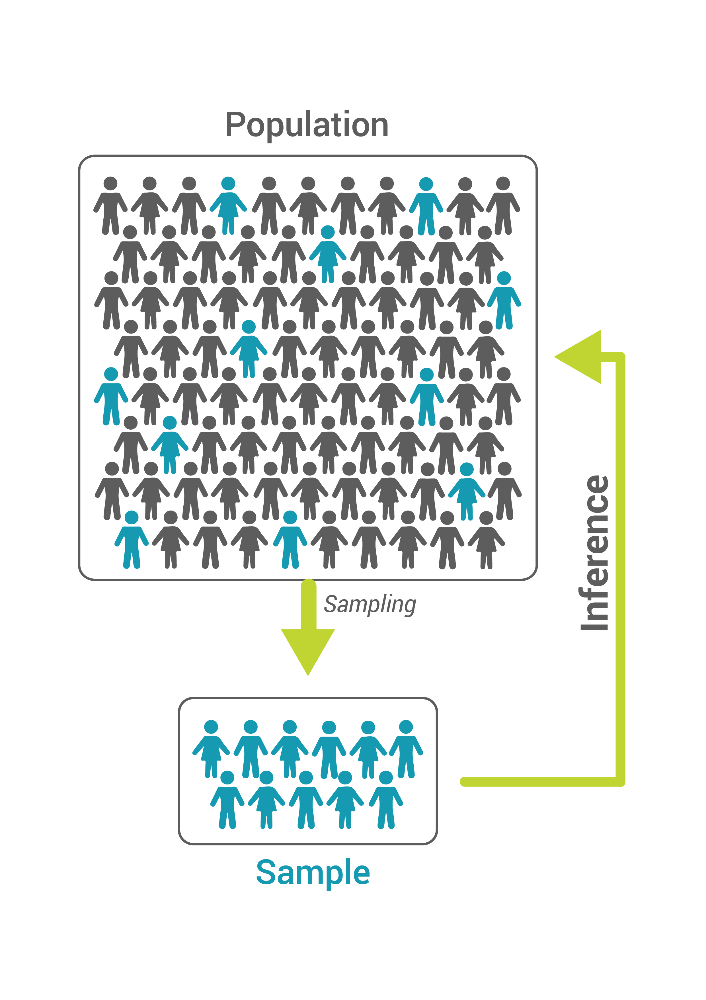
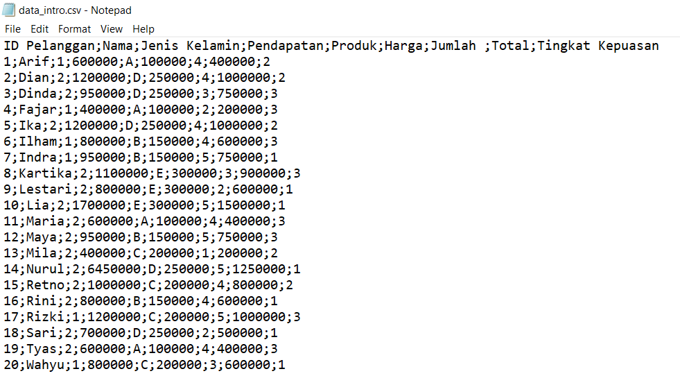
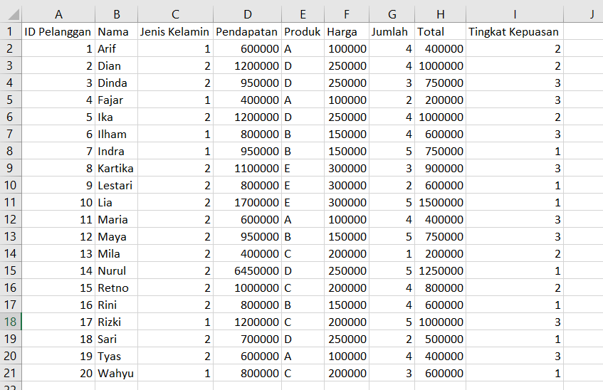
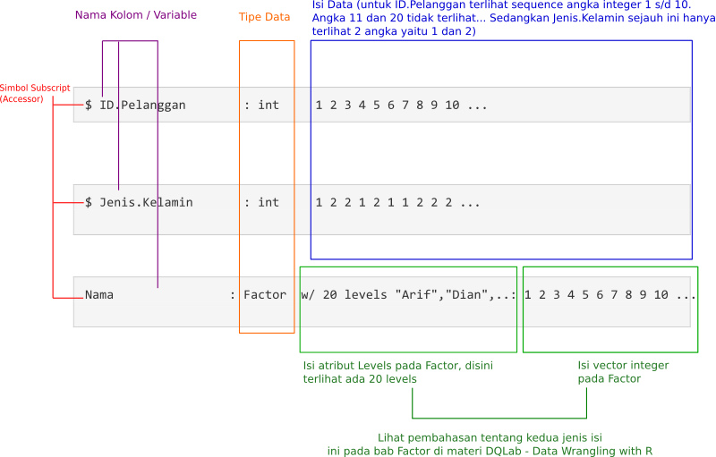
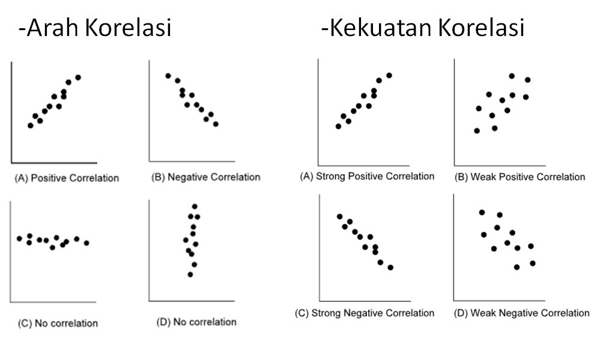
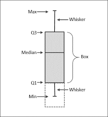

```{r setup, include=FALSE}
knitr::opts_chunk$set(echo = TRUE, comment = "", message = F, warning = F)
```

# Dasar-dasar Statistik

Pada chapter 1 kita akan belajar

- Pengertian statistik
- Jenis-jenis Data
- Estimasi karakteristik Data

## Pendahuluan

Statistika adalah ilmu yang mempelajari cara pengumpulan data, menganalisis data untuk mendapatkan kesimpulan informasi sampai dapat dijadikan dasar pembuatan kebijakan. Definisi diatas mirip dengan tugas dari seorang Data Science yaitu mulai dari ekplorasi data, modelling untuk mendapatakan pola yang tersembunyi dari data kemudian menemukan Insight untuk dasar kebijakan (data-driven).

**Kenapa harus belajar statistik ?**

Ilmu Statistik fungsinya untuk mengolah data, yang bisa angka maupun bukan angka. Statistik merupakan pondasi awal sebelum belajar Data Science. Alasannya, banyak tools data science merupakan pengembangan dari teknik statistik, mulai dari sederhana sampai yang rumit. Agar dapat memahami konsep-konsep tersebut, pada bab ini juga disertakan satu dataset file dengan nama data_intro.csv yang akan dijadikan file praktek di R

## Statistik sebagai Ilmu Peluang

Sebenarnya statistik merupakan ilmu peluang, yaitu untuk mendapatkan generalisasi populasi dari sampel yang kita miliki. Dalam statistik banyak kaitannya dengan sampel dan populasi, berikut pengertiannya

1. **Sampel** adalah representasi dari sebagian elemen dari populasi
2. **Populasi** adalah total dari semua elemen
 


Gambaran diatas dapat menjelaskan fungsi dari statistik, yaitu kita dapat mengetahui karakteristik dari populasi melalui sampel yang kita miliki. Kemudian untuk mengukur karakteristik dari sampel dan populasi, dengan melihat nilai statistik dan parameter. Untuk lebih jelasnya dapat dilihat pengertian berikut

Perbedaan antara statistik dan parameter adalah sebagai berikut:

- **Statistik** adalah nilai estimasi karateristik populasi.
- **Parameter** adalah nilai karakteristik populasi atau bisa disebut karakteristik sebenarnya.

Statistik lebih banyak di cari nilainya daripada parameter, alasannya adalah lebih menghemat biaya, waktu dan tenaga. Selain itu, pengambilan sampel sebenarnya sudah dapat mewakili populasi. Dan secara praktis, kita tidak mungkin melakukan pengambilan populasi karena dapat bersifat merusak. Contoh: pengambilan sample dari produksi seluruh bola lampu untuk menguji kandungan di dalamnya. Atau pengambilan seluruh populasi udang dari suatu tambak. Nilai estimasi didapatkan dari data kuantitatif dan kualitatif, untuk mengetahui perbedaanya akan dijelaskan pada subbab selanjutnya.

## Data Kuantitatif dan Kualitatif

1. **Kuantitatif** adalah data yang dinyatakan dalam bentuk angka
2. **Kualitatif** adalah data yang dinyatakan dalam bentuk bukan angka

Selanjutnya bagaimana untuk mendapatkan nilai karakteristik dari data kuantitatif dan kualitatif, jawabanya yaitu kita harus menggolongkan kedalam skala pengukuran data.

**Kenapa harus dilakukan?**

Agar data mudah untuk diolah sehingga mendapatkan nilai statistik

## Skala Pengukuran Data

Tiap data perlu suatu standar untuk melakukan pengukuran, ini disebut skala. Dan berikut adalah jenis-jenis skala pengukuran data:

- **Nominal**: adalah skala yang diberikan hanya sebagai label saja, tidak mengandung pengertian tingkatan. Contoh: Jika pria =1 dan wanita = 2, artinya disini 1 dan 2 adalah nominal yang mewakili pria dan wanita. Disini nilai 2 tidak lebih besar dari nilai 1.
- **Ordinal**: adalah skala yang mengandung pengertian tingkatan. Contoh: Data kepuasan, 1 = tidak puas, 2 = puas, dan 3 = sangat puas, artinya 1<2<3.
- **Interval**: adalah skala yang mempunyai sifat ordinal dan mengandung jarak(interval). Misalnya: harga pakaian merk A 100 ribu, harga pakaian merk C 200 ribu, artinya harga pakian merk A dan C memiliki interval 100 ribu
- **Rasio**: adalah skala yang mempunyai sifat nominal, ordinal, dan interval, serta mempunyai nilai rasio antar objek yang diukur. Contoh: harga pakaian merk A 100 ribu, harga pakaian merk C 200 ribu. Rasio harga pakaian A dengan pakaian C adalah ½. Sehingga dapat dikatakan bahwa harga pakaian A harganya 2 kali pakaian C.

Dari penjelasan diatas dapat kita simpulkan bahwa data kualitatif dapat kita golongkan menjadi skala nominal dan ordinal. Sedangkan untuk data kuantitatif maka digolongkan menjadi Interval dan Rasio.Skala pengukuran nominal dan ordinal pada R di definisikan sebagai factor atau sering disebut data kategorik sedangkan interval dan rasio di definisikan sebagai numerik.

## Dataset Tingkat Kepuasan Pelanggan

Dataset yang akan di pakai dalam course ini adalah data tentang kepuasan konsumen terhadap suatu produk pakaian. Dataset ini ada dalam file bentuk format file CSV dengan nama data_intro.csv. Data ini juga dilengkapi karakteristik umum dari konsumen. 

Berikut adalah tampilan dari dataset tersebut jika dibuka dengan aplikasi notepad.



Terlihat pemisah antar kolomnya menggunakan tanda titik koma. Terdiri dari sembilan kolom dan 20 baris data

Dan berikut adalah tampilan dari dataset tersebut jika dibuka dengan aplikasi spreadsheet.



Dataset tersebut terdiri dari sembilan kolom dengan detil berikut:

- **ID Pelanggan**: Kode pelanggan yang sifatnya unik, tidak ada data lain dengan kode yang sama. Kode ini dalam bentuk yang sangat sederhana berupa angka integer (bilangan bulat).
- **Nama**: Nama pelanggan dalam bentuk teks
- **Jenis Kelamin**: Jenis kelamin dari pelanggan, dalam bentuk angka integer. Disini 1 mewakili laki-laki dan 2 mewakili perempuan.
- **Pendapatan**: Nilai pendapatan per bulan dari tiap pelanggan (??).
- **Produk**: Produk yang disurvei.
- **Harga**: Harga produk yang dibeli.
- **Jumlah**: Jumlah produk yang dibeli.
- **Total**: Total harga pembelian.
- **Tingkat Kepuasan**: Indeks tingkat kepuasan pelanggan tersebut terhadap produk yang dibeli.

Dengan data sederhana ini diharapkan dapat mengasah kempuan analisis statistik. Kemampuan analisis statistik akan terlatih dengan *Learning By Doing*. Metode belajar ini sangat efektif untuk pemahaman ilmu statistika.

## Membaca Dataset dengan read.csv

Untuk membaca dataset data_intro.csv tersebut kita akan gunakan function read.csv dengan konstruksi berikut:

`data_intro <- read.csv("https://academy.dqlab.id/dataset/data_intro.csv", sep=";")`

Penjelasan terhadap function di atas adalah sebagai berikut:

Komponen   | Deskripsi
:---       | :---
data_intro | nama variable yang digunakan untuk menampung pembacaan file dataset data_intro.csv
read.csv   | function yang digunakan untuk membaca contoh dataset dengan format file teks (CSV)
https://academy.dqlab.id/dataset/data_intro.csv | lokasi dataset yang terdapat di web DQLab. Jika lokasi file dan aplikasi R terdapat di komputer lokal Anda, maka gantilah dengan lokasi file di lokal. Misalkan c:\data\data_intro.csv
sep=";"   | Parameter pemisah (separator) antar kolom data. Kita gunakan tanda titik koma untuk dataset tingkat kepuasan pelanggan.

**Tugas Praktek**

Lengkapi code editor untuk membaca file seperti yang ditunjukkan pada bagian Lesson.

Jika berjalan dengan lancar maka akan tampil sebagian dataset pada Console sebagai berikut.

```{r}
data_intro <- read.csv("https://academy.dqlab.id/dataset/data_intro.csv", sep=";")
data_intro
```

## Melihat Tipe Data dengan Str

Adalah praktek yang sangat baik untuk mengenal atau melakukan profile tiap dataset yang sudah dibaca ke dalam R – dan secara sederhana di R dapat kita lakukan dengan function str. Function str akan menyajikan informasi tiap kolom dataset dalam format yang compact – satu baris informasi saja per row. Pendekatan singkat dan jelas ini membuat str menjadi function favorit dan efektif untuk mengenal data di tahap awal.

Syntaxnya juga cukup sederhana, cukup masukkan dataset ke dalam function ini seperti pada contoh berikut.

`str(data_intro)`

**Tugas Praktek**

Gantilah code editor dengan perintah str yang menggunakan input variable data_intro.

Jika berjalan dengan lancar, maka outputnya sebagian akan terlihat sebagai berikut.

```{r}
str(data_intro)
```

Untuk baris di bawahnya adalah penjelasan dari tiap kolom/variable data yang terdiri dari:

- Nama kolom
- Tipe data kolom
- Isi dari kolom tersebut
- Jika Factor maka ada tambahan indexnya

Berikut penjelasan hasil dalam bentuk ilustrasi dari 3 kolom, yaitu ID.Pelanggan, Nama, dan Jenis.Kelamin.



## Merubah Tipe Data Kolom ID.Pelanggan menjadi Character

Variabel ID.Pelanggan merupakan kode unik dari setiap variabel dan tidak bisa dicari nilai statistiknya. Sehingga tipe data ID.Pelanggan perlu diubah menjadi character agar tidak ikut di analisis.

Untuk mengubah tipe data ID.Pelanggan menjadi character dapat menggunakan syntax

`data_intro$ID.Pelanggan <-as.character(data_intro$ID.Pelanggan)`

Function as.character mengubah id tiap pelanggan menjadi string/character - ditandai dengan tanda petik diantara kode unik tersebut.

**Tugas Praktek**

Gantilahcode editor dengan perintah as.character yang menggunakan input variable data_intro dengan kolom ID.Pelanggan dan Nama. Kemudian  keluarkan output untuk memastikan bahwa output tersebut berupa String.

Jika berjalan lancar maka akan tampil output sebagai berikut

```{r}
data_intro$ID.Pelanggan <- as.character(data_intro$ID.Pelanggan)
data_intro$Nama <- as.character(data_intro$Nama)

str(data_intro$ID.Pelanggan)
str(data_intro$Nama)
```

## Merubah Sejumlah Kolom menjadi Data Kategorik (Factor)

Pada data_intro beberapa variabelnya bersifat kualitatif yaitu variabel jenis kelamin, produk, dan Tingkat_Kepuasan. Variabel tersebut harus di ubah jenis datanya menjadi faktor untuk mendapatkan karakteristik dari setiap pelanggan (observasi).

Untuk mengubah tipe data menjadi factor dapat menggunakan syntax berikut:

`data_intro$Jenis.Kelamin <- as.factor(data_intro$Jenis.Kelamin)`

`data_intro$Produk <- as.factor(data_intro$Produk)`

`data_intro$Tingkat.Kepuasan <- as.factor(data_intro$Tingkat.Kepuasan)`

**Tugas Praktek**

Gantilah  code editor untuk  merubah kolom Jenis.Kelamin, Produk dan Tingkat.Kepuasan menjadi tipe data faktor (Factor). Kemudian gantilah  pada code editor untuk menampilkan struktur dari kolom Jenis.Kelamin, Produk dan Tingkat.Kepuasan dengan function str.

Jika berjalan dengan lancar maka akan tampil sebagian dataset pada Console sebagai berikut.

```{r}
data_intro$Jenis.Kelamin <- as.factor(data_intro$Jenis.Kelamin)
data_intro$Produk <- as.factor(data_intro$Produk)
data_intro$Tingkat.Kepuasan <- as.factor(data_intro$Tingkat.Kepuasan)

str(data_intro$Jenis.Kelamin)
str(data_intro$Produk)
str(data_intro$Tingkat.Kepuasan)
```

## Skala Pengukuran Data

Setelah data diubah jenis tipe datanya, selanjutnya adalah pemeriksaan untuk memastikan apakah tipe data setiap variabel sudah sesuai dengan skala pengukuran masing-masing.

Untuk melihat data dan tipe data dapat menggunakan syntax berikut :

`data_intro`

`str(data_intro)`

**Tugas Praktek**

Lengkapi pada code editor untuk menampilkan variable data_intro dan strukturnya dengan function str.

Jika berjalan dengan lancar, maka muncul 2 output berikut.

```{r}
data_intro
str(data_intro)
```

## Estimasi karakteristik

Ukuran pemusatan (mean, modus, median, presentil)

- **Modus** adalah nilai yang sering muncul dari suatu distribusi (data nominal-data rasio).
- **Median** adalah nilai tengah dari suatu distribusi (data interval dan rasio).
- **Mean** adalah rata-rata aritmatik dari suatu distribusi (data interval dan rasio).
 
Contoh

Data : 2, 2, 5, 7, 9, 9, 9, 10, 10, 11, 12

Modus = 9, Median = 9, Mean = 7,81

## Estimasi Nilai Statistik Modus

Modus merupakan nilai yang menunjukan nilai yang sering muncul. Modus digunakan untuk data bertipe nominal dan ordinal.

Untuk menampilkan modus dari data dapat menggunakan syntax

`Mode(data_intro$Produk)`

Berikut penjelasan function diatas:

- **Mode** akan menampilkan nilai terbanyak pada variabel yang diamati.
- **data_intro$Produk**, merupakan kolom Produk dari variable data_intro.

Untuk menggunakan function Mode tersebut, menggunakan library tambahan bernama "**pracma**".

**Tugas Praktek**

Lengkapi code editor untuk  membaca file seperti yang ditunjukkan pada bagian Lesson. Dan lengkapi untuk melihat modus pada kolom tingkat kepuasan.

Jika berjalan dengan lancar maka akan tampil sebagian dataset pada Console sebagai berikut.

```{r}
library(pracma)

Mode(data_intro$Produk)
Mode(data_intro$Tingkat.Kepuasan)
```

## Estimasi Nilai Statistik Median

Median merupakan nilai tengah dari suatu kumpulan data. median digunakan untuk data bertipe interval dan rasio.

Untuk menampilkan median dari data dapat menggunakan syntax

`median(data_intro$Pendapatan)`

Berikut penjelasan function diatas:

- **median** akan menampilkan nilai tengah pada variabel yang diamati.
- **data_intro$Pendapatan**, merupakan kolom Pendapatan dari variable data_intro.

**Tugas Praktek**

Lengkapi code editor untuk menghasilkan median dari kolom Pendapatan, Harga, Jumlah dan Total seperti yang diinstruksikan pada comment Lesson.

Jika berjalan dengan lancar maka akan tampil sebagian dataset pada Console sebagai berikut.

```{r}
median(data_intro$Pendapatan) 
median(data_intro$Harga) 
median(data_intro$Jumlah) 
median(data_intro$Total) 
```

## Estimasi Nilai Statistik Rata-Rata

Rata-rata merupakan nilai yang menunjukan nilai rata-rata aritmatik. Rata-rata/mean digunakan untuk data bertipe interval dan rasio.

Untuk menampilkan mean dari data dapat menggunakan syntax

`mean(data_intro$Pendapatan)`

Berikut penjelasan function diatas:

- **mean** akan menampilkan nilai rata-rata pada variabel yang diamati.
- **data_intro$Pendapatan**, merupakan kolom Pendapatan dari variable data_intro.
 
**Tugas Praktek**

Lengkapi code editor untuk membaca file seperti yang ditunjukkan pada bagian Lesson.

Jika berjalan dengan lancar maka akan tampil sebagian dataset pada Console sebagai berikut.

```{r}
mean(data_intro$Pendapatan)
mean(data_intro$harga)
mean(data_intro$Jumlah)
mean(data_intro$Total)
```

## Penggunaan Mean dan Median

Dari contoh praktik sebelumnya ada perbedaan hasil **Median** dan **Mean** untuk data interval dan rasio. Maka perlu diperhatikan untuk penggunaanya yaitu: penggunaan **mean** sebaiknya digunakan jika tidak ada **outlier**. Sebaliknya jika ada outlier, maka sebaiknya menggunakan **Median**.

Apa itu Outlier ? Outlier adalah data yang jaraknya jauh dari keseluruhan data.

## Ukuran Sebaran Data

Ukuran sebaran yang sering digunakan adalah sebagai berikut:

- **Range** adalah selisih antara nilai terbesar dan nilai terendah
- **Varians** adalah simpangan kuadrat data dari nilai rata-ratanya
- **Simpangan baku** adalah simpangan data dari nilai rata-ratanya, simpangan baku nama lainnya adalah standard error. Standard error dapat digunakan untuk melihat keakuratan dari hasil estimasi, semakin kecil standard error semakin akurat hasil estimasi.
 
## Estimasi Nilai Sebaran Data Range

Range adalah selisih antara nilai terbesar dan nilai terendah.  Untuk menampilkan range dari data dapat menggunakan syntax sebagai berikut.

`max(data_intro$Jumlah)-min(data_intro$Jumlah)`

Berikut penjelasan function diatas:

- **max** digunakan untuk mendapatkan nilai maksimal dari data.
- **min** adalah function yang digunakan mendapatkan nilai minimal dari data.

**Tugas Praktek**

Gantilah code editor dengan perhitungan range dari kolom **Pendapatan** pada variable **data_intro** dengan modifikasi contoh pada Lesson.

```{r}
max(data_intro$Pendapatan)-min(data_intro$Pendapatan)
```

## Estimasi Nilai Sebaran Data Varians

Varians merupakan simpangan kuadrat data dari nilai rata-ratanya.  Untuk menampilkan varians dari data dapat menggunakan syntax sebagai berikut

`var(data_intro$Pendapatan)`

dimana **var** adalah function yang digunakan untuk mendapatkan nilai varians dari data.

***Tugas Praktek**

Ganti dengan perintah untuk menghitung nilai varians kolom **Pendapatan** dari variable **data_intro**.

Jika berjalan dengan baik, maka hasilnya akan muncul sebagai berikut.

```{r}
var(data_intro$Pendapatan)
```

Keterangan: e+12 menunjukkan 10 pangkat 12. Jadi nilai di atas lengkapnya adalah 1.645.684.210.526.

## Estimasi Nilai Sebaran Data Simpangan Baku

Simpangan baku adalah simpangan data dari nilai rata-ratanya, simpangan baku nama lainnya adalah **standard deviasi**. Standard deviasi dapat digunakan untuk melihat keakuratan dari hasil estimasi, semakin kecil standard deviasi semakin akurat hasil estimasi.

Untuk menampilkan simpangan baku dari data dapat menggunakan syntax sebagai berikut

`sd(data_intro$Jumlah)`

dimana **sd** adalah function yang digunakan untuk mendapatkan nilai simpangan baku dari data.
Tugas Praktek

Lengkapi bagian [...1...] pada code editor untuk mengeluarkan hasil simpangan baku dari kolom Pendapatan dari variable data_intro.

Jika berjalan dengan lancar maka akan mendapatkan hasil berikut.

```{r}
sd(data_intro$Pendapatan)
```

## Kesimpulan

Dari pembahasan materi diatas maka kesimpulannya sebagai berikut:

- Statistik merupakan ilmu pengolahan,penyajian dan analisis data.
- Jenis-jenis data yaitu nominal, ordinal, interval, dan rasion.
- Estimasi karakteristik data yang sering digunakan diantaranya mean, median dan modus.
- Jenis sebaran data diantaranya range (jarak), standar deviasi, dan varians.

# Analisis Data Sederhana

Pada Chapter ini kita akan mempelajari:

- Analisis Deskriptif
- Pengenalan Uji Hipotesis
- Hubungan 2 Variabel

## Analisis Deskriptif pada variable data_intro

Analisis Deskriptif adalah proses analisa yang digunakan untuk membangun sebuah hipotesis.

Pada bab ini, analisis deskriptif akan dilakukan pada data sebelumnya dengan tujuan untuk mendapatkan informasi berikut:

- Bagaimana profil pelanggan.
- Bagaimana gambaran produk.
- Membangun hipotesis.

## Analisis Deskriptif Menggunakan Nilai Statistik

Untuk melakukan analisis deskriptif setiap variabel pada R, kita dapat menggunakan function berikut.

`summary(data_intro)`

Function summary akan menampilkan kesimpulan pada variabel masing-masing. Untuk variabel bertipe character akan menampilkan panjang datanya. Variabel bertipe factor akan menampilkan jumlah data pada masing-masing kelas. Sedangkan untuk variabel bertipe numerik akan memunculkan nilai minimum, Q1,Q2 (median), Q3, mean, dan maximum.

Pengertian dari masing-masing istilah itu adalah sebagai berikut :

- **Minimum** adalah nilai observasi terkecil.
- **Kuartil pertama (Q1)**, yang memotong 25 % dari data terendah.
- **Median (Q2)** atau nilai pertengahan.
- **Kuartil ketiga (Q3)**, yang memotong 25 % dari data tertinggi.
- **Maksimum** adalah nilai observasi terbesar.

**Tugas Praktek**

Gantilah code editor untuk  mendapatkan *summary* dari variable **data_intro**.

Jika berjalan dengan lancar maka akan muncul hasil sebagai berikut.

```{r}
summary(data_intro)
```

## Analisis Deskriptif Menggunakan Visualisasi

Setelah melakukan analisis deskriptif sebelumnya, agar lebih jelas bagaimana gambaran/sebaran dari data maka kita perlu membuat grafik dari masing-masing variabel. Grafik disini juga dapat sebagai analisis eskplorasi yang akan membantu dalam membangun hipotesis.

Untuk mendapatkan visualisasi dasar dari setiap variabel pada R bisa menggunakan perintah berikut

`plot(data_intro$Jenis.Kelamin)`

`hist(data_intro$Pendapatan)`

Berikut penjelasan function diatas:

- **plot** digunakan untuk variabel bertipe **Factor** - function ini menghasilkan grafik Bar Plot.
- **hist** untuk variabel bertipe numerik seperti **int** - function ini menghasilkan grafik Histogram.

Tujuan dari plot dan hist adalah untuk mengetahui sebaran data.

**Tugas Praktek**

Lengkapi code editor untuk untuk melakukan visualisasi data. Petunjuknya ada pada tiap comment dari code editor.

Untuk membantu berikut adalah hasil dari perintah str dari variable **data_intro** sehingga Anda bisa memutuskan untuk menggunakan plot atau hist dari kolom terkait.

```{r}
str(data_intro)

plot(data_intro$Jenis.Kelamin)
hist(data_intro$Pendapatan)
hist(data_intro$Harga)
hist(data_intro$Jumlah)
hist(data_intro$Total)
plot(data_intro$Tingkat.Kepuasan)
```

## Kesimpulan Analisis Deskriptif Menggunakan Visualisasi

Dari hasil analisis deskriptif pada praktek sebelumnya kita mendapatkan:

- Profil Pelanggan sebagai berikut:
  1. Sebagian besar pelanggan adalah berjenis kelamin perempuan.
  2. Rata-rata pendapatan pelanggan dalam sebulan adalah 875000 (tidak menggunakan ukuran pemusatan mean, karena pada grafik terdapat outlier. Sehinggan ukuran pemusatan yang dipakai adalah median).
  3. Pelanggan sering membeli produk dalam jumlah 3-4 buah.
  4. Rata-rata total belanja yang sering dihabiskan adalah 710000.
  5. Kebanyakan pelanggan sangat puas kepada produk yang dijual.
- Gambaran produk yang dijual sebagai berikut:
  - Produk yang sering dibeli adalah produk D.
  - Rata-rata harga produk yang terjual sebesar 197500.

Dari hasil statistik deskriptif diatas kita dapat membangun hipotesis, agar analisis data yang kita lakukan kaya informasi yang didapatkan. Pembangunan hipotesis berdasarkan intuisi kita terhadap data yang sudah kita lakukan eksplorasi.

Contoh hipotesis yang dapat kita bangun berdasarkan data diatas adalah sebagai berikut:

1. Apakah ada hubungan pendapatan dengan total belanja?
2. Apakah ada pengaruh suatu produk dengan kepuasan pelanggan?
3. Apakah ada hubungan jenis kelamain dengan total belanja?

## Pengenalan Uji Hipotesis

Uji hipotesis adalah metode pengambilan keputusan yang didasarkan dari analisis data. Dalam statistik dapat menguji sebuah hipotesis benar atau salah. Ada 2 jenis hipotesis yaitu hipotesis null (hipotesis nihil) dan hipotesis alternatif. **Hipotesis nihil (Ho)** yaitu hipotesis yang berlawanan dengan teori yang akan dibuktikan. **Hipotesis alternatif (Ha)** adalah hipotesis yang berhubungan dengan teori yang akan dibuktikan.

Dalam melakukan pengujian statistik kita perlu menggunakan metode statistik uji, yang sering digunakan yaitu z-test, t-test, chi-square test, dan f-test. Pada bab kali ini kita tidak akan membahas detail dari setiap statistik uji diatas, tetapi kita akan fokus cara menggunakannya.

Selanjutnya kita harus paham mengenai **p-value** dan **alpha** yang akan digunakan dalam statistik uji.

*P**-value** adalah peluang terkecil dalam menolak Ho. Sedangkan alpha adalah tingkat kesalahan. Nilai alpha biasanya adalah 1%, 5%, dan 10%. Dalam prakteknya alpha 5% sering digunakan, karena lebih moderat.

Hipotesis H0 ditolak jika nilai p-value kurang dari alpha (5%), sedangkan jika p-value lebih dari nilai alpha maka yang H0 diterima. Untuk lebih jelasnya dapat dilihat gambar dibawah ini


Sumber gambar: https://www.slideshare.net/rhandyprasetyo/statistikauji-hipotesis

## Perbedaan Statistik Deskriptif dan Statistik Inferensia

Dalam statistik ada 2 jenis analisis data, yaitu statistik deskriptif dan statistik inferensi. Uji hipotesis, yang dijelaskan pada subbab sebelumnya termasuk kedalam statistik inferensia.

Untuk membedakan antara 2 jenis analisis diatas, maka dapat menyimak penjelasan berikut:

a.**Statistik Deskriptif** adalah statistik yang digunakan untuk analisa data dengan cara menggambarkan data sampel dengan tanpa membuat kesimpulan untuk data populasi. Beberapa hal yang dapat dilakukan adalah penyajian data melalui tabel, grafik, perhitungan modus, median, mean, perhitungan penyebaran data melalui perhitungan rata-rata dan standar deviasi. Statistik Deskriptif digunakan untuk eksplorasi data.
b. **Statistik Inferensia** adalah yaitu statistik yang digunakan untuk menganalisis data sampel dan hasilnya diberlakukan untuk populasi. Beberapa hal yang dapat dilakukan adalah menguji hipotesis dengan statistik uji, seperti chi-square test, student-t test, f-test, z-score test. Statistik Inferensia dapat digunakan untuk konfirmasi dari hasil statistik deskriptif.

## Tujuan Analisis Inferensia

Tujuan Analisis berikutnya dari dataset kita adalah untuk mendapatkan informasi berikut:

- Bagaimana hubungan pendapatan dengan total belanja.
- Bagaimana pengaruh suatu produk dengan kepuasan pelanggan.
- Bagaimana hubungan jenis kelamin dengan total belanja.

## Analisis Hubungan antar variable

Pada sub-bab ini kita akan membahas cara pengujian hipotesis yang sudah kita susun diatas. Pengujian hipotesis diatas dengan menggunakan analisis inferensia. Ketiga hipotesis diatas dapat digeneralisasi sebagai hipotesis hubungan antar variabel.

Dari penjelasan sebelumnya, kita akan melakukan analisis hubungan antar variable yaitu:

1. Variabel pendapatan dengan total belanja
2. Variabel pengaruh jenis produk dengan kepuasan pelanggan
3. Variabel jenis kelamain dengan total belanja

## Hubungan Antara Variabel Numerik
Berdasarkan hasil kasus sebelumnya, kita akan melihat hubungan antara data numerik dan numerik.

Ada dua cara untuk melihat hubungan antar variabel, yaitu dengan grafik **scatter plot** dan **analisis korelasi**. Grafik scatter plot untuk melihat arah hubungan, poisitif dan negatif. Sedangkan analisis korelasi adalah untuk menguji/konfirmasi apakah kedua variabel tersebut memang berhubungan dan sebearapa kuat hubungannya.

Rentang nilai koefisien korelasi antara -1 sampai 1. Korelasi kuat ketika mendakati -1 atau 1, sedangkan dikatakan lemah jika mendekati 0. Untuk mengetahui ada hubungan atau tidaknya menggunakan analisis korelasi, dengan hipotesis sebagai berikut

- bHipotesis nihil (null): tidak ada hubungan antara kedua variabel.
- Hipotesis alternatif: ada hubungan antara kedua variabel.

Berikut gambaran yang lebih jelasnya.



Sumber gambar: https://dsmlmdblog.blogspot.com/2016/03/pengertian-dan-perhitungan-korelasi.html

## Scatter Plot

Sebelum melakukan analisis korelasi sebaiknya kita melihat hubungan dari dua variabel numerik menggunakan scatter plot. Scatter plot dapat disebut juga analisis deskriptif.

Untuk melakukan scatter plot pada R menggunakan perintah plot seperti berikut.

`plot(data_intro$Pendapatan,data_intro$Total)`

Variabel pertama yaitu data_intro$Pendapatan akan diplot untuk sumbu x,sedangkan variabel kedua yaitu data_intro$Total untuk sumbu y.

**Tugas Praktek**

Lengkapi pada code editor seperti yang ditunjukkan pada bagian Lesson. Jika berhasil dijalankan, akan mengeluarkan output seperti tampilan grafik berikut ini.

```{r}
plot(data_intro$Pendapatan,data_intro$Total)
```

## Hubungan Pendapatan dengan Total Belanja dengan cor.test

Setelah melihat hubungan variabel pendapatan dengan total belanja menggunakan scatter plot diatas maka kita akan mengujinya, apakah benar-benar pendapatan memiliki pengaruh positif terhadap total belanja

Untuk melakukan uji korelasi pada R menggunakan perintah

`cor.test(data_intro$Pendapatan,data_intro$Total)`

Berikut penjelasan function diatas:

- Function **cor.test** digunakan untuk melihat hubungan secara statistik.
- Pada korelasi test untuk mengujinya kita memakai t-test. Dengan hipotesis sebagai berikut:
  - **H0** : tidak ada hubungan antara pendapatan dan total belanja.
  - **Ha** : terdapat hubungan antara pendapatan dan total belanja

**Tugas Praktek**

Lengkapi pada code editor untuk seperti yang ada pada bagian Lesson.

Jika berhasil maka keluaran akan sebagai berikut.

```{r}
cor.test(data_intro$Pendapatan,data_intro$Total)
```

## Hubungan Antara Variabel Kategorik

Hubungannya diantara keduanya dapat dilihat dengan menggunakan tabulasi silang dan dapat juga dilihat kecenderungannya. Pada hubungan antara variabel kategorik dan kategorik tersebut tidak bisa diketahui seberapa kuat hubungan diantara keduanya dan bagimana pengaruhnya (**positif** atau **negatif**). Untuk mengetahui ada hubungan atau tidaknya menggunakan uji statistik **chi-square test**, dengan hipotesis sebagai berikut:

- **Null hipotesis**: tidak ada hubungan antara kedua variabel
- **Hipotesis Alternatif alternatif**: ada hubungan antara kedua variabel

## Hubungan Produk dengan Tingkat Kepuasan dengan chisq.test

Berdasarkan kasus diatas kita akan melihat hubungan antara data kategorik dan kategorik, yaitu variabel jenis produk dan tingkat kepuasan. Sebelum menguji hubungannya, sebaiknya dilakukan tabulasi silang sebagai analisis deskriptif. Selanjutnya analisis inferensia yaitu menguji apakah ada hubungan maka dapat digunakan **chi-square test**.

Untuk melakukan tabulasi dan uji statistik chi-square test pada R tahapannya sebagai berikut

`table(data_intro$Produk,data_intro$Tingkat.Kepuasan)`
`chisq.test(table(data_intro$Produk,data_intro$Tingkat.Kepuasan))`

Perintah **table** untuk melihat tabulasi antar variabel kategorik, sedangkan perintah **chisq.test** digunakan untuk melihat hubungan secara statistik.

Dengan hipotesis sebagai berikut :

- **H0** : tidak ada hubungan antara jenis produk dan tingkat kepuasan.
- **Ha** : terdapat hubungan antara jenis produk dan tingkat kepuasan  

**Tugas Praktek**

Gantilah masing-masing untuk mencari tabulasi antar variabel kategorik dan melihat hubungan secara statistik dengan **chi-square test**.

```{r}
table(data_intro$Produk, data_intro$Tingkat.Kepuasan)
chisq.test(table(data_intro$Produk, data_intro$Tingkat.Kepuasan))
```

## Hubungan Antara Variabel Kategorik dan Variabel Numerik

Hubungannya diantara keduanya dapat dilihat dengan membandingkan rata-rata pada setiap kategori. Jika nilai rata-ratanya berbeda maka kedua variabel memiliki hubungan. Pada hubungan antara variabel kategorik dan numerik tidak bisa diketahui seberapa kuat hubungan diantara keduanya dan bagimana pengaruhnya (positif atau negatif).

Untuk mengetahui ada hubungan atau tidaknya menggunakan uji statistik **t-test**, dengan hipotesis sebagai berikut

- **Null hipotesis**: tidak ada hubungan antara kedua variabel
- **Hipotesis Alternatif alternatif**: ada hubungan antara kedua variabel

## Hubungan Jenis Kelamin dengan Total Belanja dengan t.test

Berdasarkan kasus diatas kita akan melihat hubungan antara data kategorik dan numerik, yaitu variabel jenis kelamin dan total belanja. Sebelum menguji hubungannya, sebaiknya dilihat perbedaan rata-rata total belanja untuk laki-laki dan perempuan dengan visualisasi yaitu menggunakan boxplot. Boxplot grafik statistik dari data dengan komponen lima ukuran statistik yaitu Min, Q1,Q2, Q3, dan Max. Untuk lebih jelasnya mengenai boxplot dapat dilihat gambar dibawah ini.



Selanjutnya analisis inferensia yaitu untuk mengetahui apakah ada perbedaan rata-rata total belanja pada laki-laki dan perempuan maka digunakan statistik uji t-test.

Untuk melakukan visualisasi boxplot dan uji statistik t-test pada R tahapannya sebagai berikut

`boxplot(Total~Jenis.Kelamin,data = data_intro)`
`t.test(Total~Jenis.Kelamin,data = data_intro)`

Function **boxplot** digunakan untuk melihat secara grafik rata-rata total belanja pada laki-laki dan perempuan, sedangkan perintah **t.test** digunakan untuk melihat hubungan secara statistik. Penggunaan kedua fungsi diatas yaitu variabel pertama yang bertipe numerik, sedangkan variabel kedua variabel kategorik. Hipotesis t-test sebagai berikut :

- **Null hipotesis** : tidak ada perbedaan rata-rata total belanja antara laki-laki dan perempuan
- **Hipotesis alternatif** : ada perbedaan rata-rata total belanja antara laki-laki dan perempuan

**Tugas Praktek**

Lengkapi pada code editor untuk  membaca file seperti yang ditunjukkan pada bagian Lesson.

```{r}
boxplot(Total~Jenis.Kelamin,data = data_intro)
t.test(Total~Jenis.Kelamin,data = data_intro)
```

## Cara analisis yang runtut adalah...

1. Eksplorasi data
2. Membuat Hipotesis
3. Analisis Inferensia
4. Memberi Kesimpulan
5. Memberikan rekomendasi berdasarkan analisis data

## Kesimpulan

Selamat! Dengan menyelesaikan bab kedua ini maka Anda sudah menyelesaikan course Introduction to Statictics with R yang singkat namun padat ini!

Dari pembahasan materi diatas maka kesimpulannya sebagai berikut:

- Sebelum memulai menganalisis data harus dilihat summary per tiap variabel.
- Analisis Deskriptif digunakan untuk membangun sebuah hipotesis.
- Analisis Inferensia digunakan untuk menguji hipotesis.