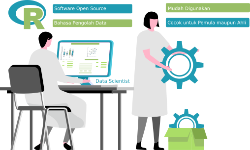

```{r setup, include=FALSE}
knitr::opts_chunk$set(echo = TRUE, comment = "", warning = F, message = F)
```

# Dasar-dasar Pemograman R

## Data Scientist dan R


Data Scientist sendiri adalah profesi yang sangat menjanjikan saat ini, dimana Anda akan merubah data-data yang sebelumnya tidak kelihatan berguna menjadi informasi yang berharga. Untuk mewujudkan hal itu, seorang data scientist tetap memerlukan suatu **software** yang penggunaan cukup simpel namun kuat (simple but powerful). Nah, software tersebut dinamakan R yang merupakan software pemrograman untuk data.

## Apa dan kenapa R?



**R** adalah nama sebuah bahasa pemrograman sekaligus software untuk pengolahan data dan grafik.

R sangat popular saat ini karena tiga hal berikut:  
- Banyak pilihan pengolahan data dengan jumlah fitur yang sangat **komplit** - dari grafik sampai machine learning.  
- **Lebih cepa**t dipelajari dan dijalankan untuk mengolah data dibandingkan dengan bahasa lain.  
- R bersifat **gratis** dan *open source* yang artinya, tidak perlu biaya lisensi yang biasanya sangat mahal untuk software pengolahan data.

## Perusahaan mana yang sudah menggunakan R?


"Tidak ada asap tanpa api", demikian suatu peribahasa yang menyatakan tidak ada rumor tanpa ada fakta yang menyertai. R sedemikian populer juga disebabkan karena digunakan perusahaan-perusahaan besar dunia. Beberapa diantaranya adalah AirBnB untuk data science, Microsoft untuk menambahkan fungsionalitas di produk-produknya, Uber untuk analisa statistik, Facebook untuk behavior analysis, dan lain-lain.

## "Hello World"

Dalam setiap pembelajaran pemograman, memunculkan tulisan "Hello World" sebagai tradisi dunia pada saat mulai belajar programming :)

**Tugas Praktek**

Cobalah ketikkan **"Hello World"** (tulis persis dengan huruf besar, huruf kecil dan tanda kutipnya) pada bagian **Code Editor**.

```{r}
"Hello World"
```

## Praktek Angka dan Perhitungan

Mari kita lanjutkan kembali praktek sederhana dengan R, kali ini Anda
diminta untuk melakukan perhitungan sederhana dengan angka dan penjumlahan
sederhana.

**Tugas Praktek**

Ketikkan pada code editor rumus **10 + 7**, dan jalankan dengan tombol **Run Code**. 

```{r}
10 + 7
```
Dimana 17 adalah hasil perhitungan dari rumus 10 + 7. Abaikan simbol > dan [1] untuk saat ini.

## Variable dalam R

Penggunaan variable pada pemrograman sangat penting untuk menampung angka maupun teks di R dengan suatu **nama**.

**Tugas Praktek**

Pada **Code Editor** masukan code untuk membuat variable **a** sebagai berikut:

`a = 5`

Ini artinya variable a diisi dengan angka 5. Selanjutnya tambahkan lagi pada Code Editor perintah berikut.

`print(a)`

Ini digunakan untuk mencetak isi variable **a**. Klik tombol **Run Code** dan amati yang dimuncul di console.

```{r}
a = 5
print(a)
```

# Lanjutan dasar-dasar R

## Comment pada R

Comment merupakan teks untuk menambahkan keterangan pada code kita,
sehingga kita akan ingat apa yang dilakukan ketika membuka kembali code tersebut. 

Comment tidak dianggap sebagai code yang bisa dieksekusi

Pada R penggunaan comment adalah dengan mengawali suatu teks dengan tanda '#'.

Berikut ini contoh penggunaan comment

`10 + 7 #Ini adalah baris komentar`

## Praktik Penggunaan Comment

Ketikkan suatu komentar setelah perhitungan matematika berikut ini pada **Code Editor**.

`10 + 7 #Ini adalah baris komentar`

Cobalah dijalankan dengan **Run Code**, dan jika lancar, maka Anda akan mendapatkan hasil berikut.

```{r}
10 + 7 #Ini adalah baris komentar
```
Dari proses ini kelihatan bahwa comment tidak diproses oleh R, jadi yang ditampilkan hanya hasil perhitungan matematika. 

## Vector pada R

Vector adalah suatu struktur data yang dapat menyimpan lebih dari satu data yang digunakan pada di R.

Penggunaannya sangat sederhana, yaitu menggunakan fungsi c disertai data-data yang ingin disimpan.

`c(5, 10, 20)`

ini artinya Anda menyimpan nilai 5, 10 dan 20 dalam satu struktur. Dan jika Anda ingin menyimpan rangkaian
angka yang terutut, misalkan angka 1 sampai dengan 20 dapat diketikkan sebagai berikut.

`c(1:20)`

## Praktek Penggunaan Vector - Bagian Satu

Ketikkan perintah c(3, 10, 15) pada **Code Editor**.

`c(3, 10, 15)`

Klik tombol **Run Code** dan perhiatikan output yang dihasilkan pada bagian **Console** sebagai berikut.

```{r}
c(3, 10, 15)
```
Terlihat perintah c(3, 10, 15) ini membuat tiga rangkaian angka yaitu 3, 10 dan 15 yang disimpan dan ditampilkan bersamaan dalam suatu vector.

## Praktek Penggunaan Vector - Bagian Dua

Selain mengetikkan satu per satu data pada vector, kita juga bisa membuat rangkaian data dengan operator titik dua. Cobalah ketik perintah berikut pada code editor.

`c(1:5)`

Klik tombol **Run Code** dan perhatikan output yang dihasilkan pada bagian **Console** sebagai berikut.

```{r}
c(1:5)
```
Terlihat perintah c(1:5) membuat vector dengan lima rangkaian angka yang dimulai dari 1 dan diakhiri nilai 5.

## Menggunakan Fungsi Summary

Kekuatan di R adalah fungsi analisa yang kaya, salah satunya adalah fungsi bernama summary yang bisa digunakan untuk mensimpulkan data yang lagi kita proses.

Cobalah ketik perintah untuk melihat karakteristik dari vector berikut.

`summary(c(1:5))`

Jalankan dan Anda akan mendapatkan hasil pada Console seperti berikut.

```{r}
summary(c(1:5))
```

Ini artinya dari vector tersebut terdapat angka paling kecil 1 (Min), angka paling besar 5 (Max), angka rata-rata 3 (Mean), dan angka tengah 3 (Median). Untuk 1st Qu dan 3rd Qu kita abaikan dulu.

## Selamat untuk kamu!


Kamu baru saja mempelajari dasar awal Bahasa Pemrograman R sebagai langkah awal menjadi seorang Data Scientist. Masih banyak modul pelajaran yang akan kamu pelajari lebih dalam untuk mengaplikasikan teknik data science secara tepat menggunakan beragam studi kasus Industri.

# You Have Passed the Module

