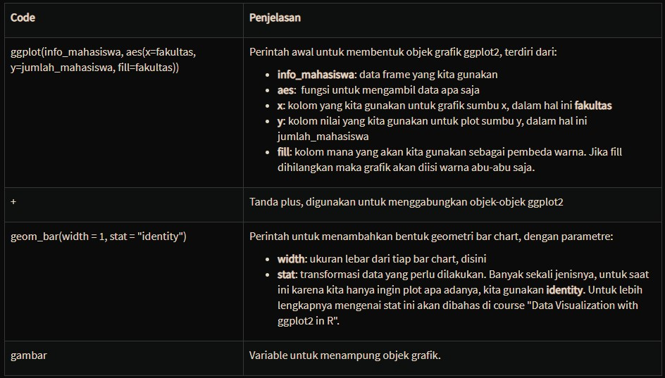

```{r setup, include=FALSE}
knitr::opts_chunk$set(echo = TRUE, comment = "", warning = F, message = F)
```

# Let’s Get Started with R

Pada bab pembuka ini Anda akan belajar mengenai apa itu R, hubungannya dengan data science, dan kenapa seorang data scientist menggunakan R. Anda juga akan dituntun dengan berbagai topik praktek dasar R.

## Pendahuluan


Course "R Fundamental for Data Science" ini adalah course pembuka DQLab untuk topik pengolahan data menggunakan R. Dengan durasi singkat, 15 menit. Anda akan mempelajari dan mendapatkan hal-hal berikut pada course ini

- Mengerti apa dan kenapa R digunakan oleh para data scientist dan dicari oleh perusahaan besar dunia.
- Menguasai dasar bahasa R seperti penggunaan teks, angka, dan rumus.
- Menguasai penggunaan tipe data fundamental R.
- Mengerti bagaimana membaca file Excel.
- Mengenali bagaimana grafik dihasilkan di R.
- Sertifikat pencapaian dari PHI-Integration dan Universitas Multimedia Nusantara (Kompas Group).

## Jadi, apa itu R?


**R** adalah nama sebuah bahasa pemrograman sekaligus software untuk pengolahan data dan grafik. R sangat popular saat ini karena memiliki jumlah fitur yang sangat besar - mencapai puluhan ribu fitur. Mulai dari membaca file teks, membaca database, menghasilkan berbagai grafik, menghasilkan dashboard yang menarik, sampai ke penggunaan machine learning - semuanya tersedia di R. Selain itu, R bersifat gratis dan open source. Artinya, dengan R kita tidak perlu biaya lisensi macam-macam untuk menggunakannya secara bebas dan luas.

**Data Scientist dan R**

Dunia saat ini penuh dengan data, akibat meluasnya penggunaan aplikasi smartphone dan juga pemakaian sistem pada seluruh perusahaan. Namun data-data ini belum tentu menjadi informasi yang dibutuhkan oleh organisasi dan bisnis bila tidak bisa diolah dengan baik. Sekarang muncul sebuah disiplin ilmu untuk menjawab permasalahan tersebut, ilmu yang mempelajari bagaimana mengolah data menjadi informasi yang berguna, yaitu **data science**. Seseorang yang bekerja dengan dibekali ilmu data science dinamakan data scientist - saat ini merupakan salah satu profesi paling hot menurut LinkedIn. Untuk membantu pekerjaannya, data scientist perlu dibekali dengan aplikasi yang bagus - R dengan segala kekayaan adalah jawabannya.

## Kenapa Data Scientist menggunakan R?


Apa sebenarnya yang membuat para data scientist tertarik belajar dan menggunakan R?

Ada empat alasan utama, yaitu:

- **Lebih Mudah Dipelajari (Easier)**: R relatif lebih mudah dipelajari dibandingkan dengan bahasa lain, seperti Java, C#, Javascript, dan lain-lain.

- **Lebih Cepat (Faster)**: Banyak fungsi R memberikan hasil jauh lebih cepat dibandingkan dengan aplikasi lain.
Contoh: R dapat menghasilkan berbagai visualisasi yang menarik dalam waktu singkat, sehingga data scientist dapat jauh lebih produktif dalam memahami data dan menghasilkan informasi.

- **Lebih kaya fitur (Richer)**: Dengan puluhan ribu fitur yang terus berkembang, hampir semua permasalahan data dapat dijawab oleh R. Sebagai contoh, untuk mengatasi permasalahan optimasi stok di e-commerce, R memiliki fungsi menghasilkan rekomendasi product packaging.

- **Telah terbukti (Proven)**: R sudah digunakan oleh banyak data scientist perusahaan besar seperti Anz, Uber, dan Facebook dan memberikan solusi riil. Tidak heran jika akhirnya dari kisah sukses ini, banyak lowongan data scientist mencamtumkan R sebagai syarat keterampilan yang harus dimiliki.

Berbekal alasan-alasan tersebut, kami yakin Anda akan lebih percaya diri dengan membekali diri belajar R!

## Code Pertama, Hello World!

Mari kita langsung praktek dengan halaman Live Code Editor ini:

1. Cobalah ketik teks atau code **"Hello World"** pada bagian panel Code Editor persis di bawah bagian lesson ini.
2. Jalankan dengan menekan tombol **Run**.
3. Jika berjalan dengan lancar, Anda akan mendapatkan hasil seperti pada berikut.

```{r}
"Hello World"
```

Nomor 3 adalah output yang Anda akan dapatkan dimana teks "Hello World" dikirimkan ke sistem DQLab dan dijalankan. 

Sekarang mari kita tambahkan perintah berupa perhitungan matematika, ketik **1+5** di bawah "Hello World".

Jalankan code tersebut, dan jika berhasil maka akan muncul hasil berikut di Console.

```{r}
"Hello World"
1 + 5
```

Terlihat perhitungan 1 + 5 menghasilkan angka 6. Nah, begitulah kira-kira R menjalankan programnya.

## Apa dan Kenapa R?

<iframe width="100%" height="500" src="https://www.youtube.com/embed/tFgd5VxOLLs" frameborder="0" allow="accelerometer; autoplay; encrypted-media; gyroscope; picture-in-picture" allowfullscreen></iframe>

## Teks, Angka dan Rumus Perhitungan

R merupakan bahasa yang berisi berbagai perintah, dari perintah melakukan perhitungan matematika sederhana sampai menghasilkan grafik. Perintah ini bisa sangat singkat, hanya berisi angka atau teks saja. Sebagai contoh, cobalah ketik angka 9 dan teks "Budi" berikut pada Code Editor.

```{r}
9
"Budi"
```

Elemen ekspresi | Keterangan
--- | ---
9 | Menampilkan angka 9
[1] | Menunjukkan posisi urutan dari hasil output pertama. Kebetulan disini output hanya ada satu item, yaitu angka 9 – jadi posisinya otomatis adalah 1.
"Budi" | Menampikan teks Budi
[1] | Menunjukkan posisi urutan dari hasil output kedua. Kebetulan disini output hanya ada satu item, yaitu teks "Budi" – jadi posisinya otomatis adalah 1.

Cobalah lanjutkan coding di atas dengan perintah.

```{r}
9 * 3
```

Berikut adalah penjelasan elemen dari output tersebut

Elemen ekspresi	| Keterangan
--- | ---
9 * 3 | Perintah untuk melakukan perkalian angka 9 dan 3
[1] | Menunjukkan posisi urutan dari hasil output pertama. Kebetulan disini output hanya ada satu item, yaitu angka 27 – jadi posisinya otomatis adalah 1.
27 | Hasil output.

## Menampilkan dengan Fungsi Print

Pada praktek sebelumnya kita bisa menampilkan teks dan angka dengan menuliskannya secara langsung, tapi akan lebih baik apabila kita menggunakan fungsi bernama print. Mari kita ketik dua perintah print berikut pada code editor.

```{r}
print("Hello World")
print(3 + 4)
```

Dengan demikian, hasilnya akan sama apabila kita langsung mengetikkan teks ataupun formula tersebut.

## Huruf Besar, Huruf Kecil dan Format Angka

Huruf besar dan huruf kecil sangat perlu diperhatikan pada bahasa pemograman R, atau dengan kata lain R sangat case sensitive.  Sebagai contoh: "Budi" dan "BUDI" adalah dua teks yang berbeda. Sebagai contoh:

- 01 dan 1 adalah dua angka yang dianggap berbeda pada saat pengiriman jawaban.
- "12-01-1987" dan "12-1-1987" adalah hal berbeda pada saat mengirimkan jawaban.

```{r}
01
1
"01-01-1980"
"1-1-1980"
"Budi"
"BUDI"
```

## Function

Kali ini kita akan belajar apa yang dinamakan function. Function adalah perintah R yang memiliki dan menerima beberapa nilai teks maupun angka sebagai parameternya. Mari kita lihat satu fuction yang akan kita sering kita gunakan, yaitu c. Fungsi c ini digunakan untuk membuat urutan angka maupun teks. Ketikkan perintah c(10:40) berikut pada bagian Code Editor. Perintah ini berguna untuk membuat rangkaian angka dari 10 s/d 40.

```{r}
c(10:40)
```

Berikut adalah penjelasan hasil dari contoh di atas.

Elemen ekspresi | Keterangan
--- | ---
c(10:40) | Ekspresi untuk membuat rangkaian angka 10 sampai dengan 40
[1] | Menunjukkan posisi urutan (indeks) dari angka pertama dari rangkaian output di baris ke 1. Dalam hal ini angka pertama, yaitu 10 - menempati posisi urutan ke-1 dari keseluruhan output.
10 11 12 13 14 15 16 17 18 19 20 21 22 23 24 25 26 27 28 29 30 31 32 33 34 | Hasil output angka yang ditampilkan pada baris pertama.
[26] | Menunjukkan posisi indeks dari angka pertama dari rangkaian output di baris ke 2. Dalam hal ini angka pertama, yaitu 35 – menempati posisi urutan ke-26 dari keseluruhan output.
35 36 37 38 39 40 | Hasil output angka yang ditampilkan pada baris kedua.

Sekarang ubahlah perintah di atas merubah huruf c menjadi C (dari hurf kecil menjadi huruf besar).

`C(10:40)`

Klik tombol Run dan pada panel R Console akan muncul tambahan output sebagai berikut.

*Error in C(10:40) : object not interpretable as a factor*

Ini artinya perintah tersebut tidak dapat dijalankan dan mengakibatkan error atau kesalahan. Huruf c dan C disini memiliki arti yang sangat berbeda.

**Tugas Praktek**

Hapus seluruh perintah pada Code Editor, kemudian buat suatu rangkaian angka 5 s/d 10 pada Code Editor dengan menggunakan function c.

```{r}
c(5:10)
```

## Variable

Angka-angka yang kita gunakan dapat juga disimpan dengan sesuatu yang dinamakan variable. Variable memiliki nama yang dapat kita definisikan dan gunakan untuk mengambil nilainya kembali. Untuk memahami hal ini, cobalah ketik perintah berikut pada Code Editor.

```{r}
budi_berat_kg <- 68
santi_berat_kg <- 54.5

budi_berat_kg
santi_berat_kg
```

Penjelasan Hasil

Elemen ekspresi | Keterangan
--- | ---
budi_berat_kg <- 68 | Memasukkan data berupa angka 68 ke dalam variable bernama budi_berat_kg. Maksud variable tersebut dinamakan demikian untuk menyatakan bahwa angka yang dimasukkan mewakili berat badan seorang bernama Budi dalam satuan kilogram – atau singkatnya berat Budi 68 kg. Nilai dimasukkan dengan bantuan operator <-. Operator ini disebut assignment operator. Perhatikan bahwa perintah ini juga tidak mengeluarkan output apapun di bawahnya.
santi_berat_kg <- 55 |Ini sama tujuannya dengan perintah di atas, memasukkan data berupa angka 55 ke dalam variable bernama santi_berat_kg. Informasi variable tersebut adalah berat Santi 55 kg.
budi_berat_kg | Menampilkan isi data dari nama variable budi_berat_kg.
[1] 68 | Menampilkan angka 68 – yang merupakan isi dari variable budi_berat_kg.
santi_berat_kg | Menampilkan isi data dari nama variable santi_berat_kg.
[1] 55 | Menampilkan angka 55 – yang merupakan isi dari variable santi_berat_kg.

**Tugas**

Lanjutkan penambahan code pada code editor dengan dua perintah berikut.

- Buat satu variable dengan nama pi dan isilah dengan nilai 3.14
- Tampilkan isi variable pi.

```{r}
pi <- 3.14
pi
```

## Comment pada R

**Comment** atau komentar adalah teks yang bisa dimasukkan di R, tapi tidak dianggap sebagai code yang bisa dieksekusi. Comment ini biasanya digunakan sebagai catatan untuk menjelaskan potongan code yang ada. Membuat comment sangat mudah. Caranya adalah menuliskan tanda pagar (#) yang kemudian diikuti dengan tulisan apapun. Berikut adalah contoh perhitungan matematika yang diikuti oleh sebuah comment. 

```{r}
2 + 2 #Ini adalah baris komentar
```

Perhatikan bahwa comment "Ini adalah baris komentar" tidak dimengerti oleh R dan tidak menghasilkan apapun. Hal yang berbeda dengan perhitungan "2 + 2" yang tetap menghasilkan output angka 4.

## Kesimpulan

Selamat, Anda telah menyelesaikan bab pertama mengenai apa itu R, hubungan dengan data science dan kenapa data scientist menggunakannya sebagai alat bantu utama. Selain itu, Anda juga telah menguasai keterampilan dasar R dengan beberapa praktek berikut:

- Mengolah dan menampilkan data dengan perintah print ataupun mengetikkan langsung data tersebut.
- Melakukan perhitungan matematika.
- Memberikan komentar atau comment untuk memberi penjelasan pada code di R.
- Menyimpan angka, teks dan hasil perhitungan ke dalam variable - sehingga dapat digunakan pada bagian code lain.
- Menjelaskan sifat R yang case sensitive - huruf besar dan huruf kecil adalah berbeda.

# Vector, List and Data Frame

Disini Anda akan belajar mengenai konsep dan penggunaan tipe data fundamental penting: vector, list dan data frame. Dengan menguasai tiga tipe data ini dan operasinya, Anda akan lebih mudah memahami R.

## Pendahuluan


Dengan berbekal teori dan praktek sebelumnya, sekarang kita telah siap untuk mengenal **tipe data** dan **operasi data** yang lebih berguna pada kasus nyata, misalkan untuk dapat ditampilkan dengan bermacam komposisi grafik yang menarik. Untuk mencapai hal ini kita perlu mengenal tiga tipe data yang paling sering digunakan di R, yaitu **vector, list dan data frame**. Kita akan belajar konsep dan praktek detil untuk mengenali semuanya dengan lebih baik. Khusus untuk data frame akan dicontohkan dengan fungsi pembacaan file teks, sehingga Anda akan mendapatkan pengalaman yang lebih nyata kenapa harus menggunakan tipe data ini pada praktek sehari-hari.

## Vector

Vector adalah jenis data di R dengan struktur yang menyimpan deretan nilai (lebih dari satu nilai) dengan tipe data sama. Jadi, jika tipe datanya teks maka seluruh data harus bertipe teks. Demikian juga jika tipenya angka maka seluruh data angka semua. Vector didefinisikan dengan nama function yang memilki satu huruf saja: c. Sebagai contoh untuk membuat vector yang isinya angka dengan nilai 2, 5, dan 7, maka perintahnya adalah **c(2, 5, 7)**. Cobalah ketik perintah tersebut di bagian bawah komentar "Ini adalah contoh vector untuk angka numerik dengan 3 data c(4, 5, 6)" sehingga tampilan code editor tampak sebagai berikut.

```{r}
c(4, 5, 6)
```

Ini artinya Anda telah membuat dan menambilkan sebuah vector yang berisi tiga 3 angka: 4, 5 dan 6. Terlihat tiga angka tersebut semua ditampilkan dalam satu baris.

Sekarang kita akan simpan vector ini ke dalam variable **angka** dan ditampilkan bukan dengan menggunakan fungsi **print** pada bagian bawah comment "# Variable bernama angka dengan input berupa vector".

```{r}
angka <- c(4, 5, 6)
print(angka)
```

Terlihat pada baris terakhir, variable angka yang kita tampilkan sama seperti tampilan awal yang menunjukkan angka-angka ini disimpan dalam bentuk vector.

## Deretan Nilai dengan Operator :

Operator : atau titik dua adalah operator yang digunakan untuk mempersingkat penulisan dari nilai-nilai vector yang berurutan. Sebagai contoh, perintah c(1, 2, 3, 4, 5, 6, 7, 8, 9, 10) yang membentuk vector dengan angka 1 sampai dengan 10 dapat dipersingkat dengan c(1:10). Ketiklah empat perintah berikut pada code editor, dimana variable angka1 diisi dengan vector dengan penulisan angka berurutan yang panjang. Dan variable angka2 diisi dengan menggunakan operator :.

```{r}
angka1 <- c(1, 2, 3, 4, 5, 6, 7, 8, 9, 10)
print(angka1)
angka2 <- c(1:10)
print(angka2)
```

Terlihat walaupun diisi dengan cara berbeda, tampilan isi dari kedua variable tersebut sama.

## Vector dengan Isi Teks

Selain angka, vector juga bisa diisi dengan teks. Cobalah ketik satu perintah pada code editor untuk membuat vector yang isinya tiga nama orang dan disimpan sebagai variable  nama_mahasiswa sebagai berikut. 

```{r}
nama_mahasiswa <- c("Amira","Budi","Charlie")
print(nama_mahasiswa)
```

Terlihat vector yang ditampilkan adalah urutan teks "Amira", "Budi", dan "Charlie". Ini menunjukkan bahwa vector bisa berisi teks selain angka.

## Index dan Accessor pada Vector

Pada latihan sebelumnya kita sudah mengerti cara membuat vector untuk angka dan teks, namun belum ditunjukkan cara untuk mengambil tiap nilai dari vector tersebut. Perhatikan pada live code editor telah terisi code-code yang dapat Anda praktekkan sambil melihat penjelasan di bawah ini.

- Untuk mengambil isi vector, kita harus mengambil dari posisinya. Posisi ini diwakili oleh angka urutan – yang disebut sebagai **index**.
- Cara penulisan index di variable adalah angka yang diapit dengan kurung siku tunggal atau ganda. Penulisan ini selanjutnya disebut sebagai **accessor**.
- Jika index yang ingin diambil lebih dari satu, maka hanya boleh menggunakan kurung siku tunggal.

Mari kita langsung contohkan agar lebih jelas. Pada code editor kita telah membuat suatu variable vector angka dengan isi berupa angka numerik 20 sampai dengan 30.

```{r}
angka <- c(20:30)
print(angka)
```

Terlihat nilai dari urutan ketiga pada vector angka ini adalah angka 22, bagaimana kita mengambil nilai ini? Seperti petunjuk di atas, kita bisa gunakan accessor dan index dengan perintah berikut.

```{r}
print(angka[3])
```

Kita juga bisa mengambil urutan indeks dengan menggunakan accessor dengan format kurung siku ganda sebagai berikut.

```{r}
print(angka[[5]])
```

Bagaimana dengan indeks angka lebih dari satu dan berurutan, misalkan saya ingin mengambil posisi keempat, kelima dan keenam dan menampilkannya?

Berikut adalah perintah yang perlu Anda ketikkan - dengan indeks menggunakan operator titik dua (:).

Tampilkan isi variable angka pada posisi ke 4 s/d 6" dan jalankan.

```{r}
print(angka[4:6])
```

Sekarang kita coba beralih ke vector teks. Buatlah variable dengan nama kode_prodi dengan isi "DKV","ILKOM", dan "ICT". cobalah Anda ketik sendiri perintah untuk menampilkan nilai urutan ketiga pada variable kode_prodi ini.

```{r}
kode_prodi <- c("DKV","ILKOM","ICT")
print(kode_prodi[3])
```

## Named Vector

Selain dengan angka, indeks pada vector juga dapat dilengkapi dengan nama untuk tiap elemennya dengan menggunakan format penulisan **name=value**. Mari kita langsung praktekkan dengan contoh, ketik named vector berikut - dimana kita membuat vector angka dengan tiap urutan diberi nama.

```{r}
nilai <- c(statistik = 89, fisika = 95, ilmukomunikasi = 100)
print(nilai)
```

Dengan mudah Anda mungkin bisa melihat bahwa vector ini mewakili nilai-nilai untuk mata kuliah "statistik", "fisika" dan "ilmukomunikasi".

Perhatikan terdapat perbedaan tampilan output named vector ini dengan tampilan output vector sebelumnya - yaitu sudah tidak ada awalan [1].

Nah, sekarang kita akan mengambil dan menampilkan nilai pada vector untuk nama "fisika". 

```{r}
print(nilai["fisika"])
```

Bagaimana, cukup jelas?

Sebagai latihan sehingga Anda benar-benar menguasai bahan named vector ini, cobalah buat variable named vector **profil** dengan input berikut:

nama = "Budi"
tempat_tinggal = "Jakarta"
tingkat_pendidikan = "S1"
Kemudian tampilkan variable profil ini dengan menggunakan fungsi print.

```{r}
profil <- c(nama = "Budi", tempat_tinggal = "Jakarta", tingkat_pendidikan = "S1")
print(profil)
```

## List

List adalah jenis data di R yang mirip dengan vector, perbedaannya adalah list dapat menyimpan lebih dari satu jenis data.Untuk memasukkan isi ke dalam struktur data ini kita gunakan function **list**.

Sebagai contoh, untuk membuat list yang isinya campuran jenis data angka 2, "Budi", dan angka 4 – maka perintahnya adalah sebagai berikut.

`list(2, "Budi", 4)`

Panel code editor telah dilengkapi rangkaian contoh code untuk menghasilkan list dan komentarnya sekaligus menjelaskan apa yang dilakukan. Jalankan dengan tombol      untuk melihat hasilnya.

Catatan: Perhatikan hasil eksekusi seperti di bawah. Terlihat outputnya agak berbeda dengan vector - dimana tiap output terdapat dua tampilan accessor (kurung siku tunggal dan ganda).

```{r}
list(2, "Budi", 4)
```

Tugas
Buatlah variable dengan nama **kota** dengan isi berikut

nama_kota = "Makassar"
propinsi = "Sulawesi Selatan"
luas_km2 = 199.3

```{r}
kota <- list(nama_kota = "Makassar", propinsi = "Sulawesi Selatan", luas_km2 = 199.3)
kota
```

## List Index

Untuk mengambil isi list, kita bisa mengambil dari posisi index-nya, ketentuan dan caranya sama persis dengan vector.

Contoh: Untuk mengambil posisi kedua dari variable list list_saya kita bisa gunakan

`list_saya[2]`

atau

`list_saya[[2]]`

```{r}
# Membentuk list dengan 2 angka dan 1 character
list_saya <- list(2, "Budi", 4)

# Menampilkan index kedua dengan aksesor kurung siku tunggal 
list_saya[2]

# Menampilkan index kedua dengan aksesor kurung siku ganda
list_saya[[2]]

# Menampilkan index kedua s/d ketiga
list_saya[2:3]
```

**Tugas**

Buatlah variable dengan nama **list_satu** dengan isi angka 1, character “Online”, dan nilai logical TRUE. Tampilkan index pertama dari list tersebut dengan accessor kurung siku ganda.

```{r}
list_satu <- list(1, "Online", TRUE)
list_satu[[1]]
```

## Data Frame

Data frame adalah jenis struktur data yang dirancang untuk representasi table, yang terdiri dari banyak kolom dengan tiap kolom berisi list ataupun vector dengan jumlah data yang sama. Untuk membuat data frame kita bisa gunakan function **data.frame**. Panel code editor telah dilengkapi contoh code untuk membuat data frame untuk data mahasiswa. Jalankan dengan tombol  untuk melihat hasilnya.

**Tugas**

Tambahkan pada code editor, tugas-tugas berikut. Code-code yang sebelumnya ada di code editor tidak boleh dihapus

- Buatlah vector terbaru bernama akreditasi dengan isi ("A","A","B","A","A")
- Buat satu data frame dengan nama info_mahasiswa yang terdiri dari dua vector dari contoh ditambah dengan vector akreditasi.
- Tampilkan data frame info_mahasiswa.

```{r}
#Membuat dua variable vector
fakultas <- c("Bisnis", "D3 Perhotelan", "ICT", "Ilmu Komunikasi", "Seni dan Desain")
jumlah_mahasiswa <- c(260, 28, 284, 465, 735)

#Membuat data frame dari kedua vector di atas
info_mahasiswa <- data.frame(fakultas, jumlah_mahasiswa)

#Melihat isi data frame
info_mahasiswa

#Buat vector baru sebagai representasi akreditasi
akreditasi <- c("A","A","B","A","A")

#Buat data frame dari ketiga vector di atas
info_mahasiswa <- data.frame(info_mahasiswa, akreditasi)
info_mahasiswa
```

## Cara Akses Data Frame\

Data frame memiliki banyak kolom dan bisa diakses dengan nama kolom yang digunakan. Caranya adalah menggunakan accessor dengan tanda $ yang diikuti dengan nama kolom.

Contoh: info_mahasiswa$fakultas.

```{r}
#Membuat tiga variable vector
fakultas <- c("Bisnis", "D3 Perhotelan", "ICT", "Ilmu Komunikasi", "Seni dan Desain")
jumlah_mahasiswa <- c(260, 28, 284, 465, 735)
akreditasi <- c("A","A","B","A","A")

#Membuat data frame dari kedua vector di atas
info_mahasiswa <- data.frame(fakultas, jumlah_mahasiswa, akreditasi)

#Menampilkan kolom jumlah_mahasiswa
info_mahasiswa$jumlah_mahasiswa
```


**Tugas**

Tambahkan code untuk menampilkan kolom fakultas dari data frame info_mahasiswa.

```{r}
#Menampilkan kolom fakultas
info_mahasiswa$fakultas
```

## Kesimpulan

Anda telah belajar mengenai tiga tipe data fundamental yang sangat penting di R pada bab ini, yaitu vector, list dan data frame. Tiga tipe data ini dapat diisi dengan lebih dari satu nilai. Ringkasan dari tipe-tipe data tersebut adalah sebagai berikut.

- **Vecto**r hanya bisa diisi dengan salah satu tipe data saja di seluruh elemennya, misalkan angka ataupun teks. Pembuatan vector menggunakan fungsi c, dan bisa diakses dengan accessor dengan angka indeks yang diapit kurung siku. Namun jika berupa named vector, maka indeksnya adalah berupa teks.
- **List adalah tipe data yang bisa diisi dengan lebih dari satu tipe data di seluruh elemennya, dengan campuran teks dan angka misalnya. Pembuatan list adalah menggunakan fungsi list, dan seperti vector elemen pada list diakses dengan accessor yang diapit kurung siku.
- **Data Frame** adalah tipe data yang terdiri dari satu atau beberapa vector ataupun list. Untuk membuat data frame kita gunakan fungsi  data.frame, dan kita bisa mengakses menggunakan accessor $ diikuti nama kolom, dan juga angka indeks.

Dengan memahami penggunaan vector, list dan data frame kita siap mempelajari penggunaan banyak fungsi advanced di R, seperti menghasilkan grafik dan penggunaan algoritma machine learning.

# Chart and Graphic

Pada bab ini, Anda akan mempelajari secara singkat bagaimana membuat visualisasi data dengan ggplot2 - salah satu extension paling populer dari R.

## Pendahuluan

Jika kita ingin eksplorasi dan menganalisa data lebih jauh, grafik adalah tipe tampilan yang tidak bisa ditawar. Dan R memiliki fungsi yang kaya untuk menghasilkan grafik.

Bab ini akan berisi perkenalan singkat dan padat untuk menunjukkan kemampuan ini dengan menggunakan package **ggplot2**. Dengan pendekatan yang bersifat demo, Anda cukup mengikuti petunjuk sehingga bisa membayangan apa saja yang bisa Anda lakukan dengan ggplot2.

## Package ggplot2

Pada dua bab sebelumnya, kita telah mampu menggunakan banyak perintah yang masih dalam paket standard di R. Untuk kebanyakan kasus, fungsi-fungsi standard ini tidak cukup.

Nah, untuk fungsi yang lebih powerful seperti menghasilkan grafik yang advanced - kita perlu menggunakan apa yang dinamakan package.

`gambar <- ggplot(info_mahasiswa, aes(x=fakultas, y=jumlah_mahasiswa, fill=fakultas))`

Untuk memahami konsep package ini, pada editor terdapat potongan code untuk menghasilkan grafik. Cobalah jalankan, dan Anda akan mendapatkan error seperti ini.

`could not find function "ggplot"`

Terlihat ada tampilan error berwarna merah yang menyatakan bahwa fungsi ggplot tidak ditemukan. Ini karena fungsi tersebut bukan fungsi standar, tapi harus menggunakan package ggplot2 dengan fungsi library.

```{r}
library("ggplot2")
```

Jika berhasil, maka akan muncul grafik berikut yang menunjukkan jumlah mahasiswa berdasarkan fakultas di salah satu universitas di Tangerang.

```{r}
gambar <- ggplot(info_mahasiswa, 
                 aes(x=fakultas, 
                     y=jumlah_mahasiswa, 
                     fill=fakultas)) + 
  geom_bar(width=1, stat="identity")

gambar
```

Dari grafik tersebut, terlihat Seni dan Desain adalah fakultas paling favorit dengan jumlah mahasiswa terbanyak :)

## Membuat Grafik Sebaran Mahasiswa (1)

Pada praktek kali ini, kita akan menghasilkan bar chart sederhana dengan menggunakan variable data frame bernama **info_mahasiswa** yang kita hasilkan pada subbab "Vector, List dan Data Frame". Variable ini masih bersifat statis atau hard code, artinya data frame ini bukan berdasarkan pembacaan dari suatu file atau database.

Cara membuat grafik di R bisa menggunakan banyak cara, salah satunya dengan library **ggplot2** - dimana kita menggambar chart secara bertahap, yaitu dengan konsep layering (lapisan demi lapisan).

Untuk lebih jelasnya, pada code editor telah terdapat code-code untuk menghasilkan distribusi mahasiswa. Cobalah jalankan, dan jika lancar akan menghasilkan grafik berikut. 

```{r}
gambar <- ggplot(info_mahasiswa, 
                 aes(x=fakultas, 
                     y=jumlah_mahasiswa, 
                     fill=fakultas))
gambar <- gambar + geom_bar(width=1, stat="identity")

gambar
```

Terlihat kalau mahasiswa di fakultas "Seni dan Desain" merupakan fakultas dengan jumlah mahasiswa terbanyak, diikuti kemudian oleh fakultas "Ilmu Komunikasi", "ICT", "Bisnis" dan "D3 Perhotelan". Dengan histogram ini, informasi lebih mudah dilihat dan dicerna dibandingkan dengan angka bukan?

Bagaimana grafik ini dihasilkan di ggplot?  Seperti informasi sebelumnya, grafik ini digambar lapis demi lapis. Dan lapisan pertama kita ibaratkan sebagai "kanvas" lukisan, dan untuk membuat "kanvas" pada contoh di code editor, kita gunakan fungsi yang namanya **ggplot**. 

`gambar <- ggplot(info_mahasiswa, aes(x=fakultas, y=jumlah_mahasiswa, fill=fakultas))`

Di sini terlihat hasil ggplot2 disimpan pada variable gambar. Variable ini yang akan menyimpan seluruh grafik dan digunakan untuk menggambar ketika digunakan sendiri pada code editor dengan perintah berikut.

`gambar`

Penambahan bentuk, warna dan ukuran dilakukan dengan menggunakan tanda operator plus ( + ) diikuti fungsi terkait. Sebagai contoh, untuk menggambar bentuk bar chart di atas "kanvas" kita gunakan fungsi geom_barSebagai contoh, untuk menggambar bar chart di atas "kanvas" kita gunakan fungsi 

`gambar <- gambar + geom_bar(width=1, stat="identity")`

Berikut adalah penjelasan lengkap dari code yang terdapat pada code editor.



**Latihan Praktek**

Mari kita sedikit improvisasi dari gambar plot tersebut dengan penambahan-penambahan berikut ini.

- Mari kita tambahkan judul "Jumlah Mahasiswa per Fakultas" pada chart untuk memperjelas konteksnya. Ini bisa dilakukan dengan menambahkan lapisan judul pada variable gambar dengan function ggtitle("Jumlah Mahasiswa per Fakultas") sebagai berikut 

```{r}
gambar <- gambar + ggtitle("Jumlah Mahasiswa per Fakultas")
gambar
```

- Dengan cara yang sama di atas, cobalah tambahkan lagi di atas gambar dengan perintah xlab("Nama Fakultas"). Ini agar caption pada sumbu X berubah dari hanya "fakultas" menjadi "Nama Fakultas". 

```{r}
gambar <- gambar + xlab("Nama Fakultas")
gambar
```

- Dengan cara yang sama, cobalah tambahkan sendiri lapisan untuk merubah caption "jumlah_mahasiswa" menjadi "Jumlah Mashasiswa" dengan perintah `ylab("Jumlah Mahasiswa")`. Jika berhasil maka caption sumbu Y akan berubah seperti berikut.

```{r}
gambar <- gambar + ylab("Jumlah Mahasiswa")
gambar
```

## Membaca File Excel

Banyak pengolahan data di R harus membaca dari file Excel. Pada contoh kali ini,  kita akan menggunakan file yang berisi data jumlah mahasiswa per angkatan per tahun.

File tersebut bernama **mahasiswa.xlsx**, dan akan kita baca dengan fungsi **read.xlsx** dari package **openxlsx** dengan cara berikut.

```{r}
library(openxlsx)
mahasiswa <- read.xlsx("https://academy.dqlab.id/dataset/mahasiswa.xlsx", sheet = "Sheet 1")
```

Dari code di atas, file yang dibaca dengan fungsi read.xlsx dan kemudian disimpan sebagai variable mahasiswa (yang merupakan tipe data frame). File yang dibaca adalah "mahasiswa.xlsx" pada sheet "Sheet 1".

```{r}
print(mahasiswa)
```

Terlihat hasil pembacaan Excel ini merupakan data frame yang terdiri dari lima kolom dengan nama ANGKATAN, Fakultas, Prodi, Kode, dan JUMLAH - dan 35 baris data.

Kita akan menggunakan data frame ini sepanjang sisa bab ini, mari kita menutup subbab ini dengan menampilkan kolom Prodi dari data frame ini, caranya dengan menuliskan perintah berikut.

```{r}
print(mahasiswa$Prodi)
```

## Membuat Grafik Sebaran Mahasiswa (2)

Setelah memiliki kemampuan membaca sumber data dari luar yaitu file Excel yang berisi data jumlah mahasiswa, kita akan kembali menghasilkan grafik sebaran yang sudah kita lakukan sebelumnya - tapi kali ini dengan hasil pembacaan tersebut.

Pada code editor telah diisi code-code untuk membaca file Excel dan menghasilkan grafik histogram. Cobalah jalankan, dan jika berhasil maka akan mendapatkan grafik histogram yang menunjukkan porsi jumlah mahasiswa per fakultas.

Lalu apa perbedaan praktek kita kali ini dengan subbab "Membuat Grafik Sebaran Mahasiswa (1)"?

```{r}
library(ggplot2)
#Menggunakan package openxlsx
library(openxlsx)

#Membaca file mahasiswa.xlsx
mahasiswa <- read.xlsx("https://academy.dqlab.id/dataset/mahasiswa.xlsx", sheet = "Sheet 1")

#Membuat kanvas
gambar <- ggplot(mahasiswa, aes(x=Fakultas, y=JUMLAH, fill=Fakultas))

#Menambahkan objek bar chart, simpan kembali sebagai variable gambar
gambar <- gambar + geom_bar(width=1, stat="identity")

#Menggambar grafik
gambar
```

## Trend Jumlah Mahasiswa dari Tahun ke Tahun

Grafik histogram sebelumnya cukup baik, tapi informasi yang terkandung masih belum kita ekplorasi lebih detil. Sebagai contoh, bagaimana melihat trend jumlah mahasiswa per fakultas dari tahun ke tahun?

Subbab ini akan menunjukkan hal tersebut. Cobalah jalankan semua code yang telah dilengkapi di code editor, jika berjalan dengan lancar maka akan mendapatkan hasil berikut.

```{r}
library(ggplot2)
#Menggunakan package openxlsx
library(openxlsx)

#Membaca file mahasiswa.xlsx
mahasiswa <- read.xlsx("https://academy.dqlab.id/dataset/mahasiswa.xlsx",sheet = "Sheet 1")

#Menghitung Jumlah Data by Fakultas
summarybyfakultas <- aggregate(x=mahasiswa$JUMLAH,
                               by=list(Kategori=mahasiswa$Fakultas,
                                       Tahun=mahasiswa$ANGKATAN), FUN=sum)
summarybyfakultas <- setNames(summarybyfakultas, 
                              c("fakultas","tahun", "jumlah_mahasiswa"))

summarybyfakultas$tahun = as.factor(summarybyfakultas$tahun)

ggplot(summarybyfakultas, 
       aes(x=fakultas, y=jumlah_mahasiswa)) + 
  geom_bar(stat = "identity", 
           aes(fill = tahun), 
           width=0.8, 
           position = 
             position_dodge(width=0.8)) + 
  theme_classic() 
```

Terlihat dari tahun yang mengalami peningkatan secara konsiten adalah fakultas "ICT" dan "Seni dan Desain". Terlihat juga, fakultas "D3 perhotelan" baru ada di tahun 2017.  Untuk fakultas "Bisnis" dan "Ilmu Komunikasi" fluktuatif selama tiga tahun.

## Pie Chart

Pie chart masih merupakan chart favorit bagi banyak analis untuk menunjukkan proporsi data. Kebetulan, jumlah mahasiswa per fakultas adalah kasus proporsi yang bisa ditampilkan dengan pie chart.

Pada code editor kita telah diisi dengan code yang menghasilkan pie chart dengan menggunakan fungsi ggplot dan coord_polar. Cobalah jalankan code tersebut, dimana kita akan mendapatkan hasil berikut.

```{r}
library(ggplot2)
library(openxlsx)

#Membaca file mahasiswa.xlsx
mahasiswa <- read.xlsx("https://academy.dqlab.id/dataset/mahasiswa.xlsx",sheet = "Sheet 1")

#Menghitung Jumlah Data by Fakultas
summarybyfakultas <- aggregate(x=mahasiswa$JUMLAH,
                               by=list(Kategori=mahasiswa$Fakultas), FUN=sum)

summarybyfakultas <- setNames(summarybyfakultas, 
                              c("fakultas","jumlah_mahasiswa"))

piechart<- ggplot(summarybyfakultas, 
                  aes(x="", y=jumlah_mahasiswa, fill=fakultas)) + 
  geom_bar(width = 1, stat = "identity")

piechart <- piechart + coord_polar("y", start=0)
piechart <- piechart + ggtitle("Disribusi Mahasiswa per Fakultas")
piechart <- piechart + scale_fill_brewer(palette="Blues")+ theme_minimal()
piechart <- piechart + guides(fill=guide_legend(title="Fakultas"))
piechart <- piechart + ylab("Jumlah Mahasiswa") 
piechart
```

Terlihat porsi fakultas "Seni dan Desain" dan "Ilmu Komunikasi" menempati porsi terbesar. Angka 0 s/d 5000 di luar dari pie chart menunjukkan rentang jumlah mahasiswa secara akumulatif.

## Filtering

Praktek sekaligus demo terakhir adalah mengenai filtering data sebelum ditampilkan dalam bentuk grafik.

Cara untuk melakukan filtering di data frame adalah dengan menambahkan operator %in% dengan input berupa vector. Contoh untuk melakukan filtering ini sudah terdapat pada script di Code Editor.

```{r}
library("ggplot2")
library("openxlsx")

#Membaca file mahasiswa.xlsx
mahasiswa <- read.xlsx("https://academy.dqlab.id/dataset/mahasiswa.xlsx",
                       sheet = "Sheet 1")

#Menghitung Jumlah Data by Fakultas
summarybyfakultas <- aggregate(x=mahasiswa$JUMLAH,
                               by=list(Kategori=mahasiswa$Fakultas,
                                       Tahun=mahasiswa$ANGKATAN), 
                               FUN=sum)

summarybyfakultas <- setNames(summarybyfakultas,
                              c("fakultas","tahun", "jumlah_mahasiswa"))

summarybyfakultas$tahun = as.factor(summarybyfakultas$tahun)

ggplot(summarybyfakultas[summarybyfakultas$fakultas %in% 
                           c("ICT", "Ilmu Komunikasi"),], 
       aes(x=fakultas, y=jumlah_mahasiswa)) + 
  geom_bar(stat = "identity", 
           aes(fill = tahun), 
           width=0.8, 
           position = position_dodge(width=0.8)) + 
  theme_classic()
```

Grafiknya sama dengan subbab "Tren Jumlah Mahasiswa dari Tahun ke Tahun" tapi sudah dengan filter dua fakultas, yaitu "ICT" dan "Ilmu Komunikasi".

Ini semua bisa terjadi karena ada filtering dengan perintah berikut.

`summarybyfakultas[summarybyfakultas$fakultas %in%c("ICT", "Ilmu Komunikasi"),]`

Dimana summarybyfakultas$fakultas %in%c("ICT", "Ilmu Komunikasi") artinya melakukan filter data yang ada di kolom fakultas dari data frame summarybyfakultas.

Sedangkan perintah lengkap summarybyfakultas[summarybyfakultas$fakultas %in%c("ICT", "Ilmu Komunikasi"),] artinya mengambil data yang sudah terfilter untuk seluruh kolom.

Dengan demikian, sampai sejauh ini Anda telah diberikan gambaran mengenai kemampuan R dalam menghasilkan grafik dengan pengolahan data dari Excel. Ini tentunya bisa berpotensi tinggi untuk membantu Anda sehari-hari.

Namun memang pada bab pengenalan ini kita tidak akan membahas lebih dalam bagaimana grafik ini dapat dihasilkan dengan variasi yang lebih banyak, begitu juga pengolahan data seperti filter - tapi di course selanjutnya yaitu "Data Preparation with R" dan "Data Visualization with R".

## Penutup

Dengan berakhirnya demo grafik terakhir, berakhir juga modul R Fundamental for Data Science". Sepanjang kursus ini Anda sudah mendapatkan keterampilan R sebagai berikut:

- Mengerti apa dan kenapa R digunakan oleh para data scientist.
- Menguasai dasar bahasa R seperti penggunaan teks, angka, rumus, dan bagaimana melihat error.
- Menguasai penggunaan tipe data fundamental R, yaitu list, vector dan data frame.
- Mengerti penggunaan package tambahan untuk membaca file Excel.
- Mengenali bagaimana grafik dihasilkan di R dengan menggunakan package bernama ggplot2.

Perjalanan awal ini telah membekali Anda untuk menguasai fitur R lainnya seperti advanced data visualization (dashboard dan map), machine learning, dan otomatisasi big data.

# You Have Passed the Module

