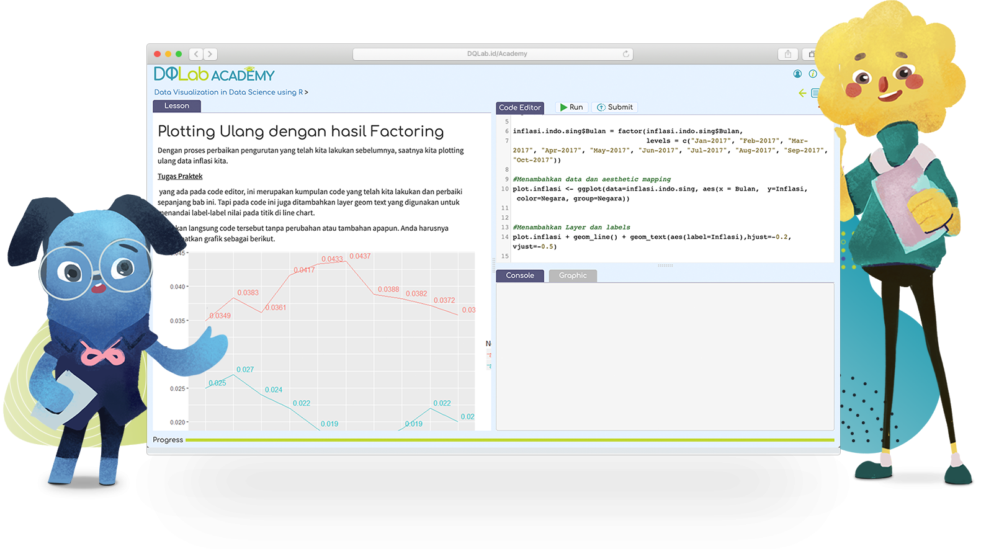
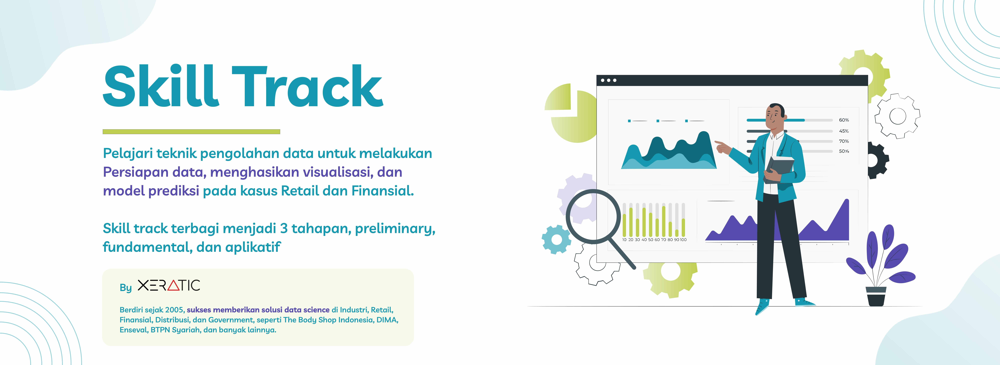
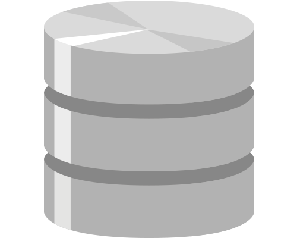
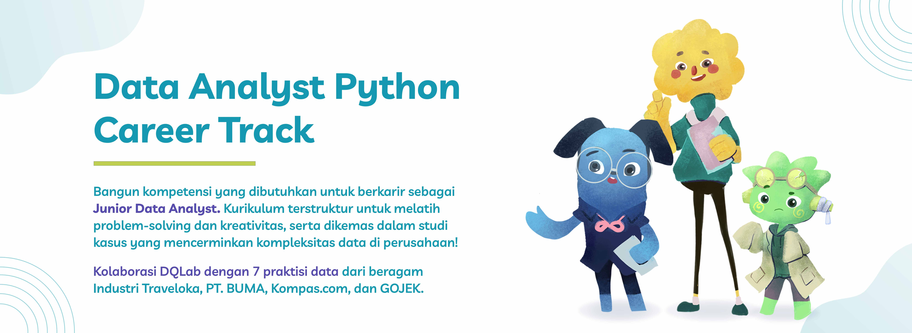

 

  

 

  <a href="https://academy.dqlab.id/main/module">DQLab</a> adalah portal belajar data yang sangat lengkap. Jika kamu ingin menjadi seorang praktisi data, maka wajib untuk belajar di DQLab. Terdapat tiga bahasa pemrograman yang disediakan, yakni R, Python, dan SQL. Ketiga bahasa tersebut sangat populer di dunia Data Science sekarang ini.

  Di DQLab, terdapat menu <b>Learn</b> dimana kita bisa belajar materi yang disajikan dengan sangat lengkap dan runtut, sehingga tidak perlu bingung mau mulai dari mana. Kemudian terdapat juga beberapa <b>Project</b> yang dibuat berdasarkan kasus di lapangan, jadi kita bisa belajar dan merasakan langsung peran dari seorang praktisi data. Tidak lupa juga terdapat <b>Career Track</b> yang bisa menjadi awal bagi kita dalam memulai karir di bidang data.

  Repositori ini saya gunakan untuk menyimpan dan membagikan data sebagai hasil dari belajar dan mengerjakan berbagai materi dan project di DQLab. Dalam setiap folder akan saya lampirkan dokumen markdown dan data yang digunakan dalam materi atau project yang bersangkutan.

 

---

<!-- # Learn -->

<h1 align="center">Skill Track</h1>

<!--   -->

<!--  -->

## Materi R 

Daftar Kelas

### Kelas Persiapan

Daftar Modul

+ [[📂](https://github.com/MyArist/DQLab/tree/master/Learn/R/Preliminary/Introduction%20to%20Data%20Science%20with%20R)] [[🔍](https://academy.dqlab.id/main/package/practice/111)] [[📃](https://academy.dqlab.id/certificate/pdf/DQLABBGINRUSPHOS)] Introduction to Data Science with R

+ [[📂](https://github.com/MyArist/DQLab/tree/master/Learn/R/Preliminary/R%20Fundamental%20for%20Data%20Science)] [[🔍](https://academy.dqlab.id/main/package/practice/1)] [[📃](https://academy.dqlab.id/certificate/pdf/DQLABINTR1CLGENH)] R Fundamental for Data Science

### Kelas Fundamental

Daftar Modul

- [[📂](https://github.com/MyArist/DQLab/tree/master/Learn/R/Fundamental/Data%20Preparation%20in%20Data%20Science%20using%20R)] [[🔍](https://academy.dqlab.id/main/package/practice/12)] [[📃](https://academy.dqlab.id/certificate/pdf/DQLABDTWR1WHPPSC/)] Data Preparation in Data Science using R

- [[📂](https://github.com/MyArist/DQLab/tree/master/Learn/R/Fundamental/Statistics%20using%20R%20for%20Data%20Science)] [[🔍](https://academy.dqlab.id/main/package/practice/15)] [[📃](https://academy.dqlab.id/certificate/pdf/DQLABINTS1FCCTIJ)] Statistics using R for Data Science

- [[📂](https://github.com/MyArist/DQLab/tree/master/Learn/R/Fundamental/Data%20Visualization%20in%20Data%20Science%20using%20R)] [[🔍](https://academy.dqlab.id/main/package/practice/2)] [[📃](https://academy.dqlab.id/certificate/pdf/DQLABDTVISNKHPAF/)] Data Visualization in Data Science using R

- [[📂](https://github.com/MyArist/DQLab/tree/master/Learn/R/Fundamental/Fundamental%20Data%20Visualization%20using%20R)] [[🔍](https://academy.dqlab.id/main/package/practice/257)] [[📃](https://academy.dqlab.id/certificate/pdf/DQLABINTR1BMSIUI/)] Fundamental Data Visualization using R

- [[📂](https://github.com/MyArist/DQLab/tree/master/Learn/R/Fundamental/Advanced%20Data%20Visualization%20for%20Everyone)] [[🔍](https://academy.dqlab.id/main/package/practice/259)] [[📃](https://academy.dqlab.id/certificate/pdf/DQLABAPL4%20PSAHWV)] Advanced Data Visualization with ggplot2 for Everyone

### Kelas Penerapan di Industri

Daftar Modul

- [[📂](https://github.com/MyArist/DQLab/tree/master/Learn/R/Applied%20Data%20Science/Data%20Science%20in%20Finance%20Credit%20Risk%20Analysis)] [[🔍](https://academy.dqlab.id/main/package/practice/81)] [[📃](https://academy.dqlab.id/certificate/pdf/DQLABMLFCRLSGBIB/)] Data Science in Finance: Credit Risk Analysis

- [[📂](https://github.com/MyArist/DQLab/tree/master/Learn/R/Applied%20Data%20Science/Data%20Science%20in%20Retail%20Market%20Basket%20Analysis)] [[🔍](https://academy.dqlab.id/main/package/practice/11)] [[📃](https://academy.dqlab.id/certificate/pdf/DQLABMLMBALMHINQ/)] Data Science in Retail: Market Basket Analysis

- [[📂](https://github.com/MyArist/DQLab/tree/master/Learn/R/Applied%20Data%20Science/Data%20Science%20in%20Marketing%20Customer%20Segmentation)] [[🔍](https://academy.dqlab.id/main/package/practice/7)] [[📃](https://academy.dqlab.id/certificate/pdf/DQLABMLMKTUNNJKU)] Data Science in Marketing: Customer Segmentation

- [[📂](https://github.com/MyArist/DQLab/tree/master/Learn/R/Applied%20Data%20Science/Data%20Science%20in%20Finance%20Dimension%20Reduction)] [[🔍](https://academy.dqlab.id/main/package/practice/89)] [[📃](https://academy.dqlab.id/certificate/pdf/DQLABPCADRJUIDUE/)] Data Science in Finance: Dimension Reduction

- [[📂](https://github.com/MyArist/DQLab/tree/master/Learn/R/Applied%20Data%20Science/Analisis%20Data%20COVID19%20di%20Indonesia)] [[🔍](https://academy.dqlab.id/main/package/practice/253)] [[📃](https://academy.dqlab.id/certificate/pdf/DQLABAPL3%20EVHSSM)] Analisis Data COVID19 di Indonesia

- [[📂](https://github.com/MyArist/DQLab/tree/master/Learn/R/Applied%20Data%20Science/A%20Walk%20Into%20Sensory%20Science)] [[🔍](https://academy.dqlab.id/main/package/practice/281)] [[📃](https://academy.dqlab.id/certificate/pdf/DQLABDSSR1CUOCJI/)] A Walk Into Sensory Science

<!--   -->
    
<!--  -->

## Materi Python 

Daftar Kelas

### Kelas Persiapan

Daftar Modul

- [[📂](https://github.com/MyArist/DQLab/tree/master/Learn/Python/Preliminary/Introduction%20to%20Data%20Science%20with%20Python)] [[🔍](https://academy.dqlab.id/main/package/practice/162)] [[📃](https://academy.dqlab.id/certificate/pdf/DQLABINTP1BJTJVQ/)] Introduction to Data Science with Python

- [[📂](https://github.com/MyArist/DQLab/tree/master/Learn/Python/Preliminary/Python%20Fundamental%20for%20Data%20Science)] [[🔍](https://academy.dqlab.id/main/package/practice/45)] [[📃](https://academy.dqlab.id/certificate/pdf/DQLABINTP1EGGMDW)] Python Fundamental for Data Science

### Kelas Fundamental

Daftar Modul

- [[📂](https://github.com/MyArist/DQLab/tree/master/Learn/Python/Fundamental/Data%20Wrangling%20Python)] [[🔍](https://academy.dqlab.id/main/package/practice/79)] [[📃](https://academy.dqlab.id/certificate/pdf/DQLABDTWP1HCKQDN)] Data Wrangling Python

- [[📂](https://github.com/MyArist/DQLab/tree/master/Learn/Python/Fundamental/Python%20for%20Data%20Professional%20Beginner%20-%20Part%201)] [[🔍](https://academy.dqlab.id/main/package/practice/157)] [[📃](https://academy.dqlab.id/certificate/pdf/DQLABINTP1JOGKCL/)] Python for Data Professional Beginner - Part 1

- [[📂](https://github.com/MyArist/DQLab/tree/master/Learn/Python/Fundamental/Python%20for%20Data%20Professional%20Beginner%20-%20Part%202)] [[🔍](https://academy.dqlab.id/main/package/practice/160)] [[📃](https://academy.dqlab.id/certificate/pdf/DQLABINTP1TJEAKE/)] Python for Data Professional Beginner - Part 2

- [[📂](https://github.com/MyArist/DQLab/tree/master/Learn/Python/Fundamental/Python%20for%20Data%20Professional%20Beginner%20-%20Part%203)] [[🔍](https://academy.dqlab.id/main/package/practice/161)] [[📃](https://academy.dqlab.id/certificate/pdf/DQLABINTP1GMBOKW/)] Python for Data Professional Beginner - Part 3

- [[📂](https://github.com/MyArist/DQLab/tree/master/Learn/Python/Fundamental/Data%20Visualization%20with%20Python%20Matplotlib%20for%20Beginner%20-%20Part%201)] [[🔍](https://academy.dqlab.id/main/package/practice/164)] [[📃](https://academy.dqlab.id/certificate/pdf/DQLABDTWP1OERWOT/)] Data Visualization with Python Matplotlib for Beginner - Part 1

- [[📂](https://github.com/MyArist/DQLab/tree/master/Learn/Python/Fundamental/Exploratory%20Data%20Analysis%20with%20Python%20for%20Beginner)] [[🔍](https://academy.dqlab.id/main/package/practice/163)] [[📃](https://academy.dqlab.id/certificate/pdf/DQLABINTP1NTJMCJ/)] Exploratory Data Analysis with Python for Beginner

- [[📂](https://github.com/MyArist/DQLab/tree/master/Learn/Python/Fundamental/Data%20Visualization%20with%20Python%20Matplotlib%20for%20Beginner%20-%20Part%202)] [[🔍](https://academy.dqlab.id/main/package/practice/165)] [[📃](https://academy.dqlab.id/certificate/pdf/DQLABINTP1PEOLAL/)] Data Visualization with Python Matplotlib for Beginner - Part 2

- [[📂](https://github.com/MyArist/DQLab/tree/master/Learn/Python/Fundamental/Data%20Quality%20with%20Python%20for%20Beginner)] [[🔍](https://academy.dqlab.id/main/package/practice/166)] [[📃](https://academy.dqlab.id/certificate/pdf/DQLABDVIZ2AUUCMW/)] Data Quality with Python for Beginner

- [[📂](https://github.com/MyArist/DQLab/tree/master/Learn/Python/Fundamental/Machine%20Learning%20With%20Python%20for%20Beginner)] [[🔍](https://academy.dqlab.id/main/package/practice/169)] [[📃](https://academy.dqlab.id/certificate/pdf/DQLABDVIZ2ODOJPA/)] Machine Learning With Python for Beginner

- [[📂](https://github.com/MyArist/DQLab/tree/master/Learn/Python/Fundamental/Fundamental%20Data%20Visualization%20with%20Python)] [[🔍](https://academy.dqlab.id/main/package/practice/177)] [[📃](https://academy.dqlab.id/certificate/pdf/DQLABINTP1TUORIC)] Fundamental Data Visualization with Python

- [[📂](https://github.com/MyArist/DQLab/tree/master/Learn/Python/Fundamental/Data%20Manipulation%20with%20Pandas%20-%20Part%201)] [[🔍](https://academy.dqlab.id/main/package/practice/178)] [[📃](https://academy.dqlab.id/certificate/pdf/DQLABINTP1KCGLNG/)] Data Manipulation with Pandas - Part 1

- [[📂](https://github.com/MyArist/DQLab/tree/master/Learn/Python/Fundamental/Data%20Manipulation%20with%20Pandas%20-%20Part%202)] [[🔍](https://academy.dqlab.id/main/package/practice/252)] [[📃](https://academy.dqlab.id/certificate/pdf/DQLABINTP1FGMHKR/)] Data Manipulation with Pandas - Part 2

- [[📂](https://github.com/MyArist/DQLab/tree/master/Learn/Python/Fundamental/Statistic%20using%20Python%20for%20Data%20Science)] [[🔍](https://academy.dqlab.id/main/package/practice/288)] [[📃](https://academy.dqlab.id/certificate/pdf/DQLABSWP1%20ELVIKP/)] Statistic using Python for Data Science

- [[📂](https://github.com/MyArist/DQLab/tree/master/Learn/Python/Fundamental/Statistic%20using%20Python%20for%20Data%20Science%20-%20Part%202)] [[🔍](https://academy.dqlab.id/main/package/practice/290)] [[📃](https://academy.dqlab.id/certificate/pdf/DQLABSWP1%20FKRWOF/)] Statistic using Python for Data Science - Part 2

- [[📂](https://github.com/MyArist/DQLab/tree/master/Learn/Python/Fundamental/Data%20Visualization%20using%20Plotnine)] [[🔍](https://academy.dqlab.id/main/package/practice/295)] [[📃](https://academy.dqlab.id/certificate/pdf/DQLABDVPP9FAWBWF/)] Data Visualization using Plotnine

### Kelas Penerapan di Industri

Daftar Modul

- [[📂](https://github.com/MyArist/DQLab/tree/master/Learn/Python/Applied%20Data%20Science/Basic%20Feature%20Discovering%20for%20Machine%20Learning)] [[🔍](https://academy.dqlab.id/main/package/practice/179)] [[📃](https://academy.dqlab.id/certificate/pdf/DQLABFATPYWBWGKN)] Basic Feature Discovering for Machine Learning

- [[📂](https://github.com/MyArist/DQLab/tree/master/Learn/Python/Applied%20Data%20Science/Data%20Science%20in%20Telco%20Data%20Cleansing)] [[🔍](https://academy.dqlab.id/main/package/practice/247)] [[📃](https://academy.dqlab.id/certificate/pdf/DQLABAPL1%20BVFPEI)] Data Science in Telco: Data Cleansing

- [[📂](https://github.com/MyArist/DQLab/tree/master/Learn/Python/Applied%20Data%20Science/Customer%20Churn%20Prediction%20using%20Machine%20Learning)] [[🔍](https://academy.dqlab.id/main/package/practice/249)] [[📃](https://academy.dqlab.id/certificate/pdf/DQLABAPL2%20JGNGCK)] Customer Churn Prediction using Machine Learning

- [[📂](https://github.com/MyArist/DQLab/tree/master/Learn/Python/Applied%20Data%20Science/Data%20Science%20Project%20Analisis%20Data%20COVID19%20di%20Dunia%20%26%20ASEAN)] [[🔍](https://academy.dqlab.id/main/package/practice/260)] [[📃](https://academy.dqlab.id/certificate/pdf/DQLABINTP1BAIQSQ/)] Data Science Project: Analisis Data COVID19 di Dunia & ASEAN

- [[📂](https://github.com/MyArist/DQLab/tree/master/Learn/Python/Applied%20Data%20Science/Data%20Analyst%20Project%20Business%20Decision%20Research)] [[🔍](https://academy.dqlab.id/main/package/practice/284)] [[📃](https://academy.dqlab.id/certificate/pdf/DQLABDVIZ2AEGGHH/)] Data Analyst Project: Business Decision Research

- [[📂](https://github.com/MyArist/DQLab/tree/master/Learn/Python/Applied%20Data%20Science/Eksplorasi%20dan%20Analisis%20Data%20COVID-19%20Indonesia%20using%20Python)] [[🔍](https://academy.dqlab.id/main/package/practice/287)] [[📃](https://academy.dqlab.id/certificate/pdf/DQLABACWP1OSMEUO/)] Eksplorasi dan Analisis Data COVID-19 Indonesia using Python

- [[📂](https://github.com/MyArist/DQLab/tree/master/Learn/Python/Applied%20Data%20Science/Data%20Science%20in%20Marketing%20%20Customer%20Segmentation%20with%20Python)] [[🔍](https://academy.dqlab.id/main/package/practice/293)] [[📃](https://academy.dqlab.id/certificate/pdf/DQLABDSCS1VGTGPJ/)] Data Science in Marketing : Customer Segmentation with Python

- [[📂](https://github.com/MyArist/DQLab/tree/master/Learn/Python/Applied%20Data%20Science/Data%20Science%20in%20Marketing%20%20Customer%20Segmentation%20with%20Python%20part%202)] [[🔍](https://academy.dqlab.id/main/package/practice/294)] [[📃](ttps://academy.dqlab.id/certificate/pdf/DQLABDSCS1TNUNDC/)] Data Science in Marketing : Customer Segmentation with Python part 2

<!--   -->

<!--  -->

## Materi SQL 

Daftar Kelas

### Kelas Persiapan

Daftar Modul

- [[📂](https://github.com/MyArist/DQLab/tree/master/Learn/SQL/Preliminary/Fundamental%20SQL%20with%20SELECT%20Statement)] [[🔍](https://academy.dqlab.id/main/package/practice/91)] [[📃](https://academy.dqlab.id/certificate/pdf/DQLABSQLT1FLMKIW)] Fundamental SQL with SELECT Statement

### Kelas Fundamental

Daftar Modul

- [[📂](https://github.com/MyArist/DQLab/tree/master/Learn/SQL/Fundamental/Fundamental%20SQL%20Using%20SELECT%20Statement)] [[🔍](https://academy.dqlab.id/main/package/practice/213)] [[📃](https://academy.dqlab.id/certificate/pdf/DQLABSQLT1VPCNOL/)] Fundamental SQL Using SELECT Statement

- [[📂](https://github.com/MyArist/DQLab/tree/master/Learn/SQL/Fundamental/Fundamental%20SQL%20Using%20FUNCTION%20and%20GROUP%20BY)] [[🔍](https://academy.dqlab.id/main/package/practice/171)] [[📃](https://academy.dqlab.id/certificate/pdf/DQLABSQLT2GFGROP/)] Fundamental SQL Using FUNCTION and GROUP BY

- [[📂](https://github.com/MyArist/DQLab/tree/master/Learn/SQL/Fundamental/Fundamental%20SQL%20Using%20INNER%20JOIN%20and%20UNION)] [[🔍](https://academy.dqlab.id/main/package/practice/244)] [[📃](https://academy.dqlab.id/certificate/pdf/DQLABSQLT2NGUHHK/)] Fundamental SQL Using INNER JOIN and UNION

- [[📂](https://github.com/MyArist/DQLab/tree/master/Learn/SQL/Fundamental/Fundamental%20SQL%20Group%20By%20and%20Having)] [[🔍](https://academy.dqlab.id/main/package/practice/291)] [[📃](https://academy.dqlab.id/certificate/pdf/DQLABFSQL3PDLJDJ/)] Fundamental SQL Group By and Having

 

---

<h1 align="center">Project</h1>

## Project R 

Daftar Project

- [[📂](https://github.com/MyArist/DQLab/tree/master/Project/R/Project%20Machine%20Learning%20for%20Retail%20with%20R%20Product%20Packaging)] [[🔍](https://academy.dqlab.id/main/package/project/16)] [[📃](https://academy.dqlab.id/certificate/pdf/DQLABPRJCTGMBDEV/)] Project Machine Learning for Retail with R: Product Packaging

- [[📂](https://github.com/MyArist/DQLab/tree/master/Project/R/Project%20Data%20Analysis%20for%20Finance%20Performa%20Cabang)] [[🔍](https://academy.dqlab.id/main/package/project/215)] [[📃](https://academy.dqlab.id/certificate/pdf/DQLABPRJ8%20BWNISN)] Project Data Analysis for Finance: Performa Cabang

- [[📂](https://github.com/MyArist/DQLab/tree/master/Project/R/Project%20Data%20Analysis%20for%20Finance%20Proses%20Investasi%20Investor)] [[🔍](https://academy.dqlab.id/main/package/project/245)] [[📃](https://academy.dqlab.id/certificate/pdf/DQLABPRJC9BNWJUF/)] Project Data Analysis for Finance: Proses Investasi Investor

- [[❌]()] [[🔍](https://academy.dqlab.id/main/package/project/298)] [[❌]()] Project Assessment using R

- [[❌]()] [[🔍](https://academy.dqlab.id/main/package/project/299)] [[❌]()] Project Analisa Klasifikasi Pinjaman untuk Sektor UMKM

<!--   -->
    
<!--  -->

## Project Python 

Daftar Project

- [[📂](https://github.com/MyArist/DQLab/tree/master/Project/Python/Data%20Science%20Challenge%20with%20Python)] [[🔍](https://academy.dqlab.id/main/package/project/158)] [[📃](https://academy.dqlab.id/certificate/pdf/DQLABPRJC2JCPTWE/)] Data Science Challenge with Python

- [[📂](https://github.com/MyArist/DQLab/tree/master/Project/Python/Data%20Engineer%20Challenge%20with%20Python)] [[🔍](https://academy.dqlab.id/main/package/project/170)] [[📃](https://academy.dqlab.id/certificate/pdf/DQLABPRJC3FKRGTH/)] Data Engineer Challenge with Python

- [[📂](https://github.com/MyArist/DQLab/tree/master/Project/Python/Project%20Machine%20Learning%20with%20Python%20Building%20Recommender%20System)] [[🔍](https://academy.dqlab.id/main/package/project/212)] [[📃](https://academy.dqlab.id/certificate/pdf/DQLABPRJC5HJDJDN/)] Project Machine Learning with Python: Building Recommender System

- [[📂](https://github.com/MyArist/DQLab/tree/master/Project/Python/Project%20Machine%20Learning%20with%20Python%20Building%20Recommender%20System%20with%20Similarity%20Function)] [[🔍](https://academy.dqlab.id/main/package/project/214)] [[📃](https://academy.dqlab.id/certificate/pdf/DQLABPRJC6RDCMTH)] Project Machine Learning with Python: Building Recommender System with Similarity Function

- [[❌]()] [[🔍](https://academy.dqlab.id/main/package/project/300)] [[❌]()] Modul DTS Professional Academy - Data Engineer

<!--   -->

<!--  -->

## Project SQL 

Daftar Project

- [[📂](https://github.com/MyArist/DQLab/tree/master/Project/SQL/Data%20Engineer%20Challenge%20with%20SQL)] [[🔍](https://academy.dqlab.id/main/package/project/99)] [[📃](https://academy.dqlab.id/certificate/pdf/DQLABSQLTSKCOKDK/)] Data Engineer Challenge with SQL

- [[📂](https://github.com/MyArist/DQLab/tree/master/Project/SQL/Project%20Data%20Analysis%20for%20Retail%20Sales%20Performance%20Report)] [[🔍](https://academy.dqlab.id/main/package/project/182)] [[📃](https://academy.dqlab.id/certificate/pdf/DQLABPRJC4RTPCTH/)] Project Data Analysis for Retail: Sales Performance Report

- [[📂](https://github.com/MyArist/DQLab/tree/master/Project/SQL/Project%20Data%20Analysis%20for%20B2B%20Retail%20Customer%20Analytics%20Report)] [[🔍](https://academy.dqlab.id/main/package/project/246)] [[📃](https://academy.dqlab.id/certificate/pdf/DQLABPRJ10BTTRKO)] Project Data Analysis for B2B Retail: Customer Analytics Report

- [[📂](https://github.com/MyArist/DQLab/tree/master/Project/SQL/Data%20Analysis%20for%20E-Commerce%20Challenge)] [[🔍](https://academy.dqlab.id/main/package/project/261)] [[📃](https://academy.dqlab.id/certificate/pdf/DQLABSQLT2NBEATA/)] Data Analysis for E-Commerce Challenge

- [[📂](https://github.com/MyArist/DQLab/tree/master/Project/SQL/Project%20Fundamental%20SQL%20Group%20By%20and%20Having)] [[🔍](https://academy.dqlab.id/main/package/project/292)] [[📃](https://academy.dqlab.id/certificate/pdf/DQLABPFSQ2DHTHGF/)] Project: Fundamental SQL Group By and Having

 

---

<h1 align="center">Career Track</h1>

## Data Analyst Career Track (Python) [[🔍](https://academy.dqlab.id/main/track/67)] [[📃](https://academy.dqlab.id/certificate/pdf/DQLABDATRCNBNGVR/TRACK)] 

Memahami Bahasa Pemrograman Fundamental

- [[📂](https://github.com/MyArist/DQLab/tree/master/Learn/Python/Fundamental/Python%20for%20Data%20Professional%20Beginner%20-%20Part%201)] [[🔍](https://academy.dqlab.id/main/package/practice/157)] [[📃](https://academy.dqlab.id/certificate/pdf/DQLABINTP1JOGKCL/)] Python for Data Professional Beginner - Part 1

- [[📂](https://github.com/MyArist/DQLab/tree/master/Learn/Python/Fundamental/Python%20for%20Data%20Professional%20Beginner%20-%20Part%202)] [[🔍](https://academy.dqlab.id/main/package/practice/160)] [[📃](https://academy.dqlab.id/certificate/pdf/DQLABINTP1TJEAKE/)] Python for Data Professional Beginner - Part 2

- [[📂](https://github.com/MyArist/DQLab/tree/master/Learn/Python/Fundamental/Python%20for%20Data%20Professional%20Beginner%20-%20Part%203)] [[🔍](https://academy.dqlab.id/main/package/practice/161)] [[📃](https://academy.dqlab.id/certificate/pdf/DQLABINTP1GMBOKW/)] Python for Data Professional Beginner - Part 3

Memahami Bahasa SQL dan RDBMS agar dapat mengolah data di Perusahaan Yang Sudah Menerapkan Sistem IT

- [[📂](https://github.com/MyArist/DQLab/tree/master/Learn/SQL/Fundamental/Fundamental%20SQL%20Using%20SELECT%20Statement)] [[🔍](https://academy.dqlab.id/main/package/practice/213)] [[📃](https://academy.dqlab.id/certificate/pdf/DQLABSQLT1VPCNOL/)] Fundamental SQL Using SELECT Statement

- [[📂](https://github.com/MyArist/DQLab/tree/master/Learn/SQL/Fundamental/Fundamental%20SQL%20Using%20FUNCTION%20and%20GROUP%20BY)] [[🔍](https://academy.dqlab.id/main/package/practice/171)] [[📃](https://academy.dqlab.id/certificate/pdf/DQLABSQLT2GFGROP/)] Fundamental SQL Using FUNCTION and GROUP BY

- [[📂](https://github.com/MyArist/DQLab/tree/master/Learn/SQL/Fundamental/Fundamental%20SQL%20Using%20INNER%20JOIN%20and%20UNION)] [[🔍](https://academy.dqlab.id/main/package/practice/244)] [[📃](https://academy.dqlab.id/certificate/pdf/DQLABSQLT2NGUHHK/)] Fundamental SQL Using INNER JOIN and UNION

Memahami Konsep dan Penerapan Exploratory Data Analysis dalam Studi Kasus Bisnis

- [[📂](https://github.com/MyArist/DQLab/tree/master/Learn/Python/Fundamental/Exploratory%20Data%20Analysis%20with%20Python%20for%20Beginner)] [[🔍](https://academy.dqlab.id/main/package/practice/163)] [[📃](https://academy.dqlab.id/certificate/pdf/DQLABINTP1NTJMCJ/)] Exploratory Data Analysis with Python for Beginner

Mengolah Dataset Dalam Jumlah Kecil sampai dengan Besar

- [[📂](https://github.com/MyArist/DQLab/tree/master/Learn/Python/Fundamental/Data%20Manipulation%20with%20Pandas%20-%20Part%201)] [[🔍](https://academy.dqlab.id/main/package/practice/178)] [[📃](https://academy.dqlab.id/certificate/pdf/DQLABINTP1KCGLNG/)] Data Manipulation with Pandas - Part 1

- [[📂](https://github.com/MyArist/DQLab/tree/master/Learn/Python/Fundamental/Data%20Manipulation%20with%20Pandas%20-%20Part%202)] [[🔍](https://academy.dqlab.id/main/package/practice/252)] [[📃](https://academy.dqlab.id/certificate/pdf/DQLABINTP1FGMHKR/)] Data Manipulation with Pandas - Part 2

Memahami Konsep dan Menghasilkan Tipe Visualisasi Data yang Tepat untuk Mempresentasikan Suatu Kasus Bisnis

- [[📂](https://github.com/MyArist/DQLab/tree/master/Learn/Python/Fundamental/Data%20Visualization%20with%20Python%20Matplotlib%20for%20Beginner%20-%20Part%201)] [[🔍](https://academy.dqlab.id/main/package/practice/164)] [[📃](https://academy.dqlab.id/certificate/pdf/DQLABDTWP1OERWOT/)] Data Visualization with Python Matplotlib for Beginner - Part 1

- [[📂](https://github.com/MyArist/DQLab/tree/master/Learn/Python/Fundamental/Data%20Visualization%20with%20Python%20Matplotlib%20for%20Beginner%20-%20Part%202)] [[🔍](https://academy.dqlab.id/main/package/practice/165)] [[📃](https://academy.dqlab.id/certificate/pdf/DQLABINTP1PEOLAL/)] Data Visualization with Python Matplotlib for Beginner - Part 2

Memahami Konsep Predictive Modeling & Mampu Menguji Tingkat Akurasi untuk Memilih Model yang Tepat

- [[📂](https://github.com/MyArist/DQLab/tree/master/Learn/Python/Fundamental/Machine%20Learning%20With%20Python%20for%20Beginner)] [[🔍](https://academy.dqlab.id/main/package/practice/169)] [[📃](https://academy.dqlab.id/certificate/pdf/DQLABDVIZ2ODOJPA/)] Machine Learning With Python for Beginner

Melakukan Investigasi dan Mendeteksi Anomali pada Data

- [[📂](https://github.com/MyArist/DQLab/tree/master/Learn/Python/Fundamental/Data%20Quality%20with%20Python%20for%20Beginner)] [[🔍](https://academy.dqlab.id/main/package/practice/166)] [[📃](https://academy.dqlab.id/certificate/pdf/DQLABDVIZ2AUUCMW/)] Data Quality with Python for Beginner

Data Analyst Project: Business Decision Research

- [[📂](https://github.com/MyArist/DQLab/tree/master/Learn/Python/Applied%20Data%20Science/Data%20Analyst%20Project%20Business%20Decision%20Research)] [[🔍](https://academy.dqlab.id/main/package/practice/284)] [[📃](https://academy.dqlab.id/certificate/pdf/DQLABDVIZ2AEGGHH/)] Data Analyst Project: Business Decision Research

 

<!-- 

  <h1>E-Books</h1>

## [[📚](https://academy.dqlab.id/ebook/download/kettle.pdf)] Data Warehouse with Kettle - Open Source ETL

  Dunia korporasi saat ini menghadapi permasalahan yang hampir sama, yaitu membengkaknya data akibat keberhasilan implementasi berbagai sistem komputer.

  Otomatisasi berjalan dengan baik, namun berbagai laporan yang ingin dihasilkan sebagai output dari sistem tersebut sebagian besar tidak tercapai.Berbagai solusi telah ditawarkan oleh para praktisi IT, dan pendekatan dengan membangun suatu data warehouse adalah yang terbaik.

  E-book ini akan membahas bagaimana membangun Data warehouse dengan Kettle yang bersifat open source dan dapat berjalan di lingkungan multi-platform.

 

## [[📚](https://academy.dqlab.id/free_ebook/adriyan_instalasi_python3_dan_ide_pada_windows10_dqlab_UPDATE.pdf)] Instalasi Python 3 dan IDE atau Anaconda Distribution pada Windows 10

  Penulis artikel tutorial ini adalah Adriyan yang saat ini menjadi salah satu Dosen Teknik Mesin Program Sarjana di Sekolah Tinggi Teknologi Nasional.

  Penulis menggunakan Python untuk riset dalam komputasi saintifik dalam ranah : identifikasi struktur berbasis sinyal vibrasi, desain, simulasi dan pengontrolan manipulator robotik paralel, dan penerapan sistem cerdas untuk penyelesaian persoalan di bidang keteknikmesinan terutama untuk vibrasi dan robotika.

  Penulis lebih banyak menggunakan Python package berupa Numpy, Scipy, SymPy, Keras dan TensorFlow, Scikit-Fuzzy, Matplotlib, dan Bokeh.

 

## [[📚](https://academy.dqlab.id/free_ebook/MNOR_A_1.pdf)] Memahami Pesan di balik Data, Instalasi dan Analisis Data Sederhana Menggunakan Python untuk Windows 10

  Penulis dari artikel tutorial ini adalah M. Nor Abdul Rajak. Saat ini penulis bekerja sebagai freelance personal assistant di salah satu perusahaan pertambangan di Kalimantan Timur.

  Harapan terbesar penulis adalah terciptanya data Environment di Kaltim, karena masih banyak yang menganggap remeh mengenai pekerjaan dalam mengolah data.

  Selain itu, penulis juga berharap artikel tutorial ini sedikit tidaknya bermanfaat untuk pembaca.

 

## [[📚](https://academy.dqlab.id/free_ebook/herry_pebbi_andra_instalasi_python_3_pada_windows_10_dqlab.pdf)] Langkah-Langkah untuk Menginstal Program Python 3 pada Sistem Operasi Windows 10 (32-Bit) Menggunakan Visual Studio Community 2019

  Penulis dari artikel tutorial ini adalah Herry Pebbi Andra. Saat ini penulis bekerja sebagai karyawan swasta pada bagian IT Staff di daerah Cikarang- Bekasi. Selain itu, penulis juga gemar belajar bahasa pemrograman dan belajar tentang keamanan digital.

  Harapan penulis dari adanya artikel tutorial ini adalah semakin banyak pemuda yang memiliki ide dan inovasi dibidang teknologi dan informasi di Indonesia dan memajukan dan membuat nama Indonesia dikenal dunia.

  "Banyak berlatih dan bertindaklah, jangan takut akan salah karena tidak akan tahu hasilnya jika tidak di coba" Quote by Herry.

 

 

## [[📚](https://academy.dqlab.id/free_ebook/PHI-Integration%20-%20Practical%20Introduction%20to%20Azure%20Machine%20Learning.pdf)] Simple Credit Approval Model using Decision Tree in Azure Machine Learning

  Teknologi Azure dan layanan Machine Learning merupakan teknologi terkini yang manfaatnya cukup banyak dirasakan. Sering kali ditemukan bagi para pemula yang ingin belajar data, kebingungan harus memulai dari mana.

  E-Book ini menghadirkan tutorial singkat dengan step by step dasar untuk studi kasus yang paling sering dihadapi yaitu membangun predictive modelling untuk layanan pemberian kredit.

  -->

---

<h1 align="center">Yuk Belajar di DQLab</h1>

Yuk belajar data science bersama DQLab dengan daftarkan diri kamu dengan signup di [dqlab.id](dqlab.id).  
Dapatkan potongan 10% dengan menggunakan kode referral "ARIS1615" atau klik [tautan ini](https://dqlab.id/signup?referralCode=ARIS1615) !
